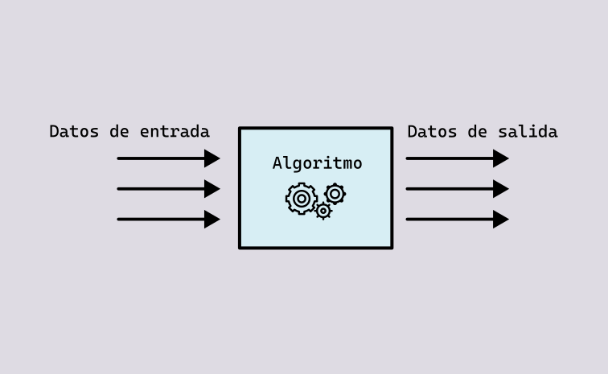

# Introducción

El objetivo es conocer la interfaz gráfica de Rhino y Grasshopper,
así como entender la definición de algoritmo y cómo Grasshopper nos ayuda a
escribir algoritmos para la

## Rhino

Rhino nos permite crear, manipular y analizar curvas y superficies NURBS,
mallas, nubes de puntos y superficies de subdivisión,
y es compatible con [una gran variedad de formatos de archivos](https://www.rhino3d.com/features/file-formats/).

## Grasshopper

Grasshopper es un _plug-in_ para Rhino con el que vamos a poder escribir
algoritmos para describir la geometría que queremos.
En otras palabras, escribiremos una secuencia de pasos a seguir para
crear nuestra geometría, y Grasshopper los ejecutará para darnos esa geometría.
De este modo, con Grasshopper tendremos la capacidad de crear una gran cantidad
de modelos 3D, o procesar grandes volúmenes de objetos escribiendo
un solo algoritmo.

## Algoritmo

Una computadora no es más que una máquina que procesa información rápidamente,
pero necesita que se le proporcionen las instrucciones para realizar dicho
procesamiento. Nosotros le podemos proporcionar esas instrucciones mediante
de un algoritmo.

Un algoritmo es una secuencia ordenada de pasos que se ejecutan para resolver
un problema, y que podemos traducir a un lenguaje que una computadora pueda
entender y ejecutar. Esto lo podemos hacer usando un lenguaje de programación
tradicional, o un lenguaje de programación visual, como Grasshopper.
De manera abstracta, podemos entender un algoritmo como una caja que recibe
datos por un lado, los procesa y nos entrega nuevos datos por el otro.

## Algoritmos en Grasshopper

Históricamente, los algoritmos se han implementado utilizando lenguajes de
programación en formato de texto, pero Grasshopper nos proporciona una interfaz
gráfica para facilitarnos enormemente este trabajo. Además, Grasshopper se
encarga de abstraer todas las matemáticas duras que hay detrás de la geometría
computacional por nosotros.

Grasshopper nos brinda herramientas para resolver problemas como

- calcular distancia entre puntos
- encontrar el punto más cercano a una curva
- proyectar una curva en un plano
- ordenar una lista de puntos
- obtener un punto sobre una superficie
- dividir una curva en segmentos iguales
- crear planos perpendiculares a una curva
- construir una esfera
- ...

Cada componente en Grasshopper se encarga de resolver uno de estos problemas.
Una vez que el componente está en el lienzo, nosotros le conectamos del lado
izquierdo los datos que necesita y nos entrega del lado derecho el resultado.

<!-- Imagen de componente -->

Combinando todas estas operanciones con cierta lógica, podremos crear
algoritmos muy complejos que nos darán como resultado datos (números y objetos
geométricos) para modelos 3D, análisis, optimizaciones, costos,
fabricación digital, etc.
