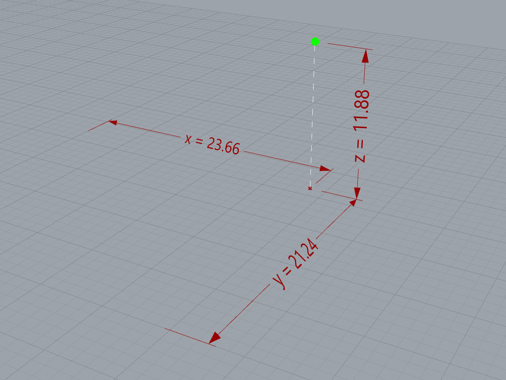
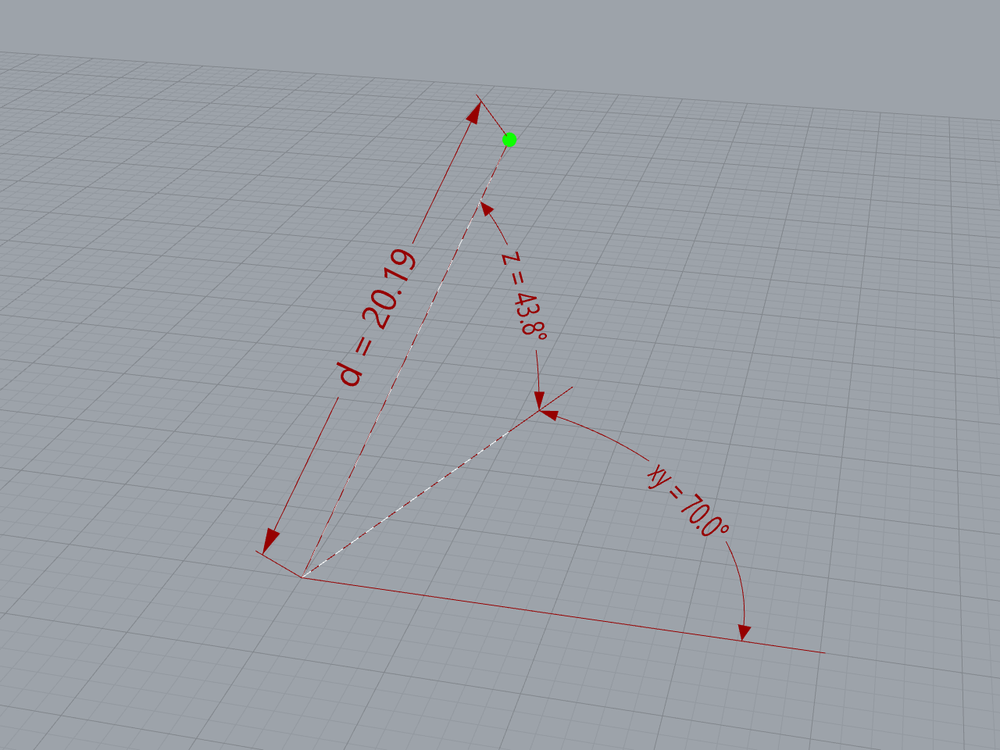
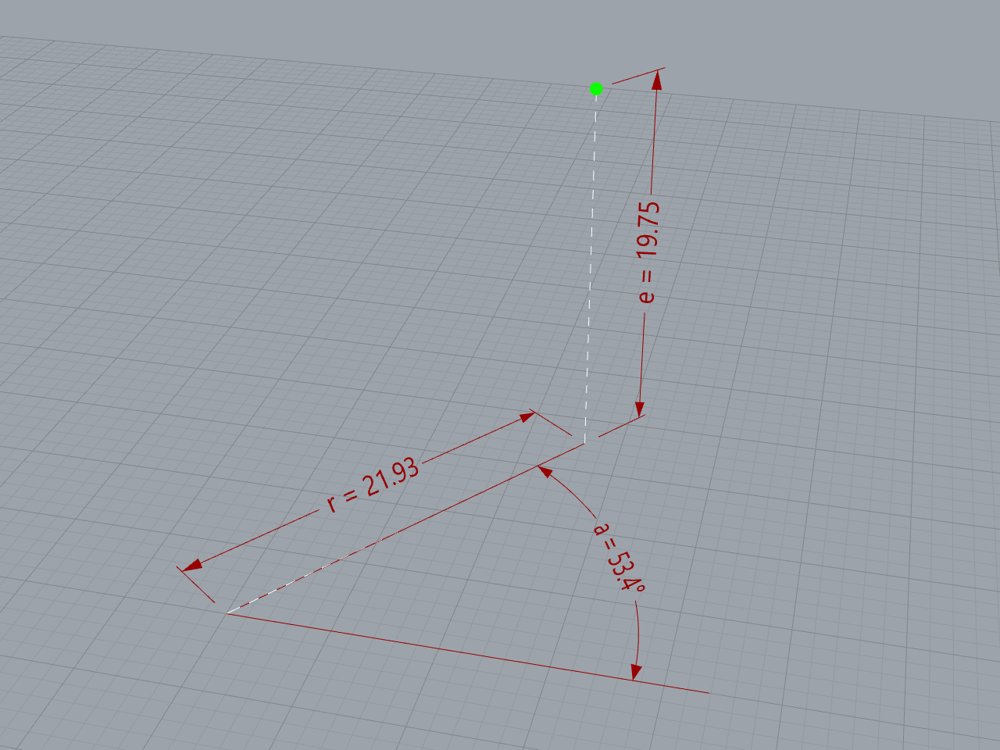

# Puntos

Un punto representa una posición única en el espacio tridimensional.
Es el objeto geométrico más simple del que se derivan todos los demás.

Un sistema de coordenadas es un sistema de referencia que nos permite
representar un punto utilizando números. Tiene un origen, que es el punto
de referencia, y tres ejes ortogonales entre sí, $X$, $Y$ y $Z$.

$$P = (x, y, z)$$

## Coordenadas cartesianas

- $x$: distancia al eje $X$
- $y$: distancia al eje $Y$
- $z$: distancia al eje $Z$

[Ejemplo: 01-coordenadas-cartesianas.gh](./01-coordenadas-cartesianas.gh)

## Coordenadas polares

- $d$: distancia al origen
- $xy$: ángulo en plano $XY$
- $z$: ángulo de elevación hacia el eje $Z$

[Ejemplo: 02-coordenadas-polares.gh](./02-coordenadas-polares.gh)

## Coordenadas cilíndricas

- $r$: radio del cilindro
- $a$: ángulo en plano $XY$
- $e$: elevación en el eje $Z$

[Ejemplo: 03-coordenadas-cilindricas.gh](./03-coordenadas-cilindricas.gh)

[Ejercicios »](./ejercicios)

[Volver »](..)
