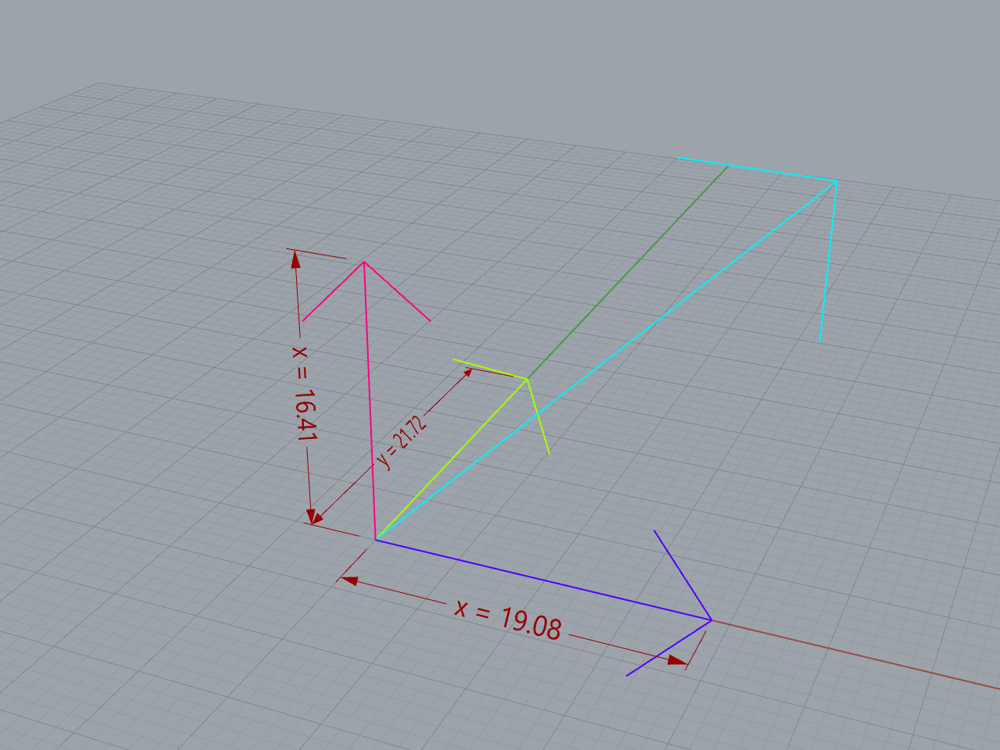
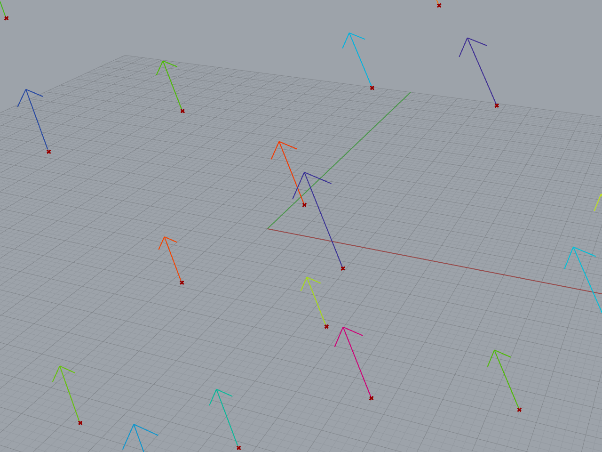
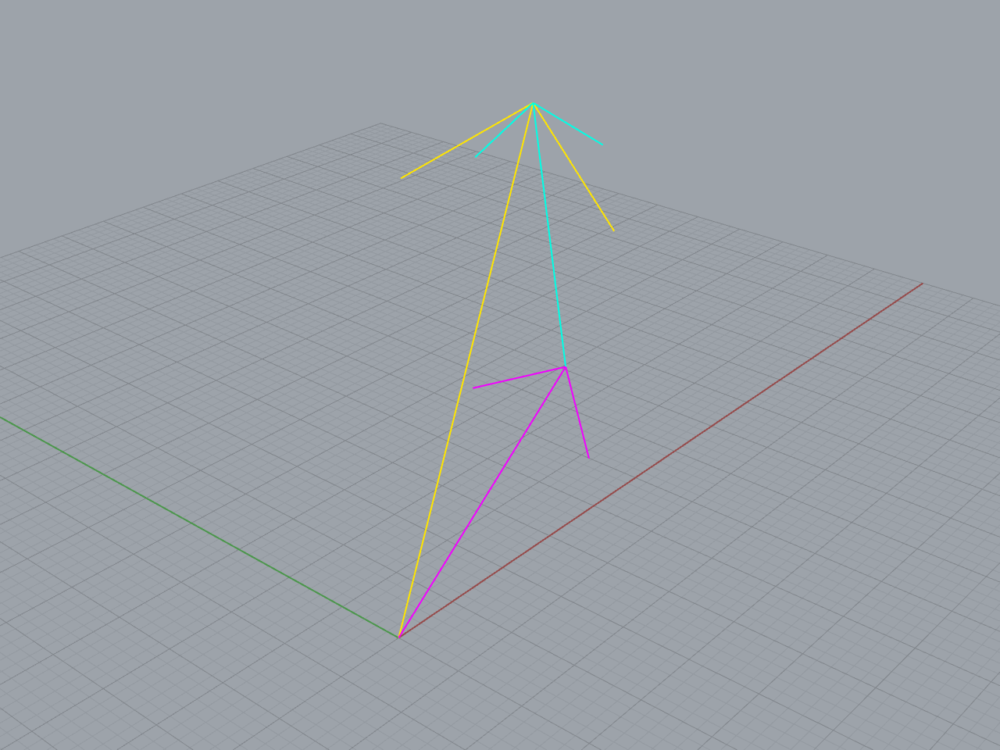
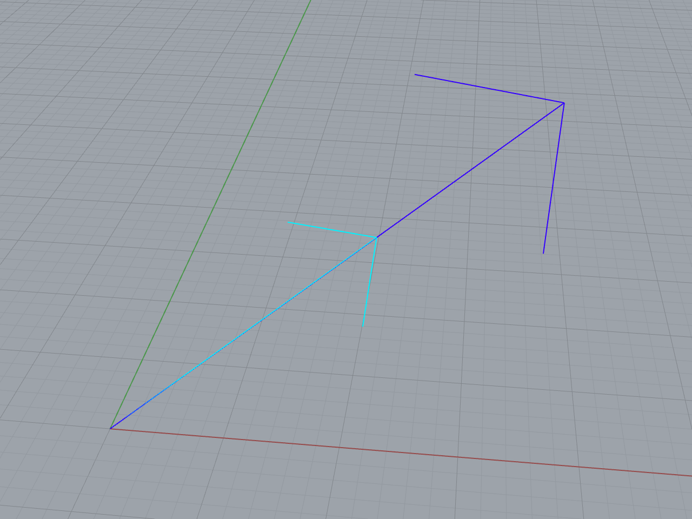
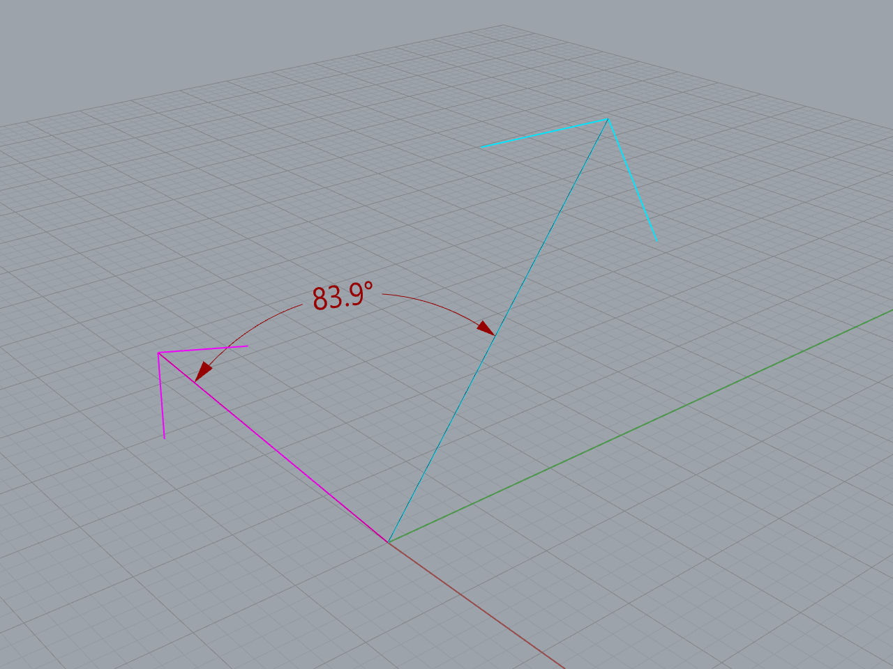
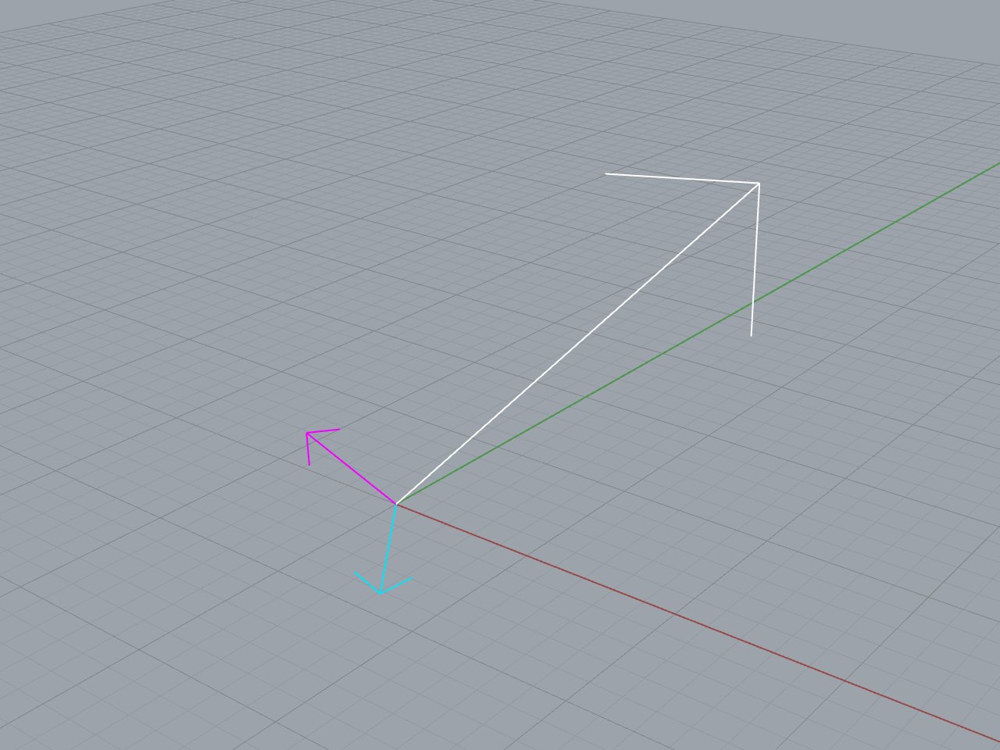

# Vectores

Un vector indica una dirección y una magnitud, y tiene tres componentes,
una por cada eje del sistema de coordenadas.

$$\mathbf{v} = \langle x, y, z \rangle$$

[Ejemplo: 01-vector.gh](./01-vector.gh)

A pesar de que su definición es parecida a la de un punto, son tipos de datos
diferentes. Mientras un punto nos indica una posición fija respecto al origen,
un vector no está asociado con ninguna posición en particular;
puede tener efecto en cualquier punto.

[Ejemplo: 02-vectores.gh](./02-vectores.gh)

A diferencia de los puntos, los vectores se pueden utilizar en operaciones
matemáticas. La suma de dos vectores da como resultado un nuevo vector
cuyas componentes son la suma de las componentes de los vectores sumados.

$$\mathbf{v} = \mathbf{v_1} + \mathbf{v_2} = \langle x_1 + x_2, y_1 + y_2, z_1 + z_2 \rangle$$

[Ejemplo: 03-suma-vectores.gh](./03-suma-vectores.gh)

Un vector se puede multiplicar por un número, y se calcula multiplicando
el número por cada una de las componentes. Esto solo modifica la magnitud
del vector, no su dirección, a menos que se multiplique por un número negativo,
en cuyo caso se invierte el sentido.

$$\mathbf{v} = a \mathbf{v_1} = \langle a x_1, a y_1, a z_1 \rangle$$

[Ejemplo: 04-multiplicacion-escalar.gh](./04-multiplicacion-escalar.gh)

Se puede calcular el ángulo entre dos vectores.

[Ejemplo: 05-angulo.gh](./05-angulo.gh)

Si tenemos dos vectores no paralelos, podemos obtener un vector perpendicular
a ambos.

[Ejemplo: 06-perpendicular.gh](./06-perpendicular.gh)

## Propiedades

- Dirección
- Magnitud, módulo o longitud
- Componente $x$
- Componente $y$
- Componente $z$

## Operaciones con vectores

- Suma
- Multiplicación por un número
- Producto punto
- Producto cruz
- Ángulo entre dos vectores

[Ejercicios »](./ejercicios)

[Volver »](..)
