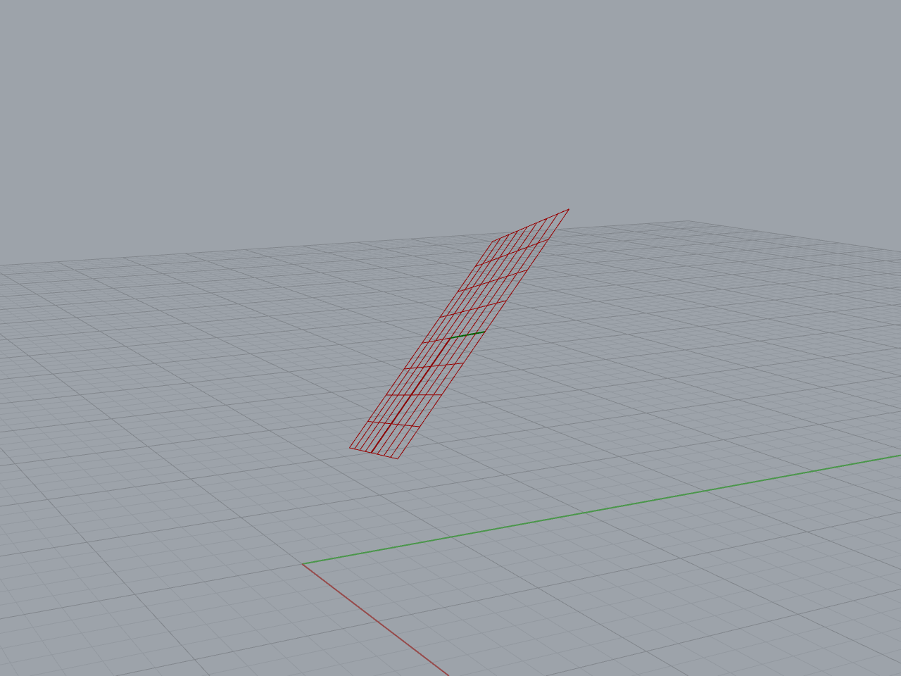

# Planos

Además del plano $XY$ universal, nosotros podemos crear planos con un origen
y una orientación según nos convenga.

[Ejemplo: 01-plano.gh](./01-plano.gh)

Podemos usar planos como referencia para la creación de objetos geométricos.

[Ejemplo: 02-planos-de-construccion.gh](./02-planos-de-construccion.gh)

Los planos pueden servir para para reorientar y reubicar objetos ya creados.

[Ejemplo: 03-reorientar.gh](./03-reorientar.gh)

También podemos proyectar geometría sobre un plano.

[Ejemplo: 04-proyectar.gh](./04-proyectar.gh)

Podemos obtener intersecciones de objetos con un plano.

[Ejemplo: 05-intersectar.gh](./05-intersectar.gh)

## Propiedades

- Origen
- Vector del eje $X$
- Vector del eje $Y$
- Vector del eje $Z$

[Ejercicios »](./ejercicios)

[Volver »](..)
