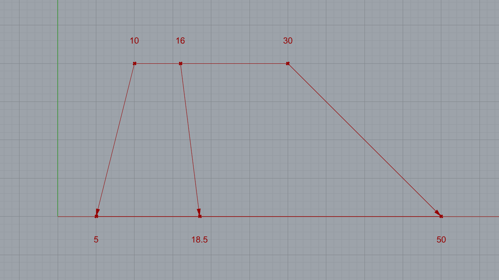
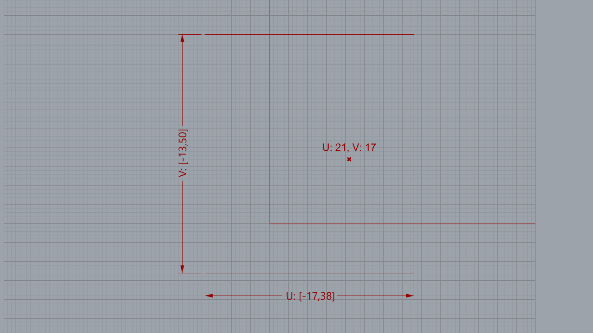

# Dominios

Un dominio representa un conjunto de números que se encuentran entre
un límite inferior y un límite superior.

$$D = [a, b]$$

Un número $n$ pertenece al dominio si $n \geq a$ y $n \leq b$.

## Remapear

Una operación muy útil y usada que se puede hacer con los dominios es
el remapeo de números. Esta operación consiste en tomar un valor numérico
que pertenece naturalmente a un dominio, y transformarlo en otro valor
que pertenece a un dominio diferente. La posición del nuevo valor
en el dominio de destino corresponde a la posición del valor original en
el dominio de origen.

[Ejemplo: 01-remapear.gh](./01-remapear.gh)

## Dominio 2D

Un dominio 2D es un dominio que tiene dos componentes, una llamada $U$
y otra llamada $V$. Lo podemos imaginar como un rectángulo cuyos límites
en el eje $X$ representan el diminio en $U$, y cuyos límites en el eje $Y$
representan el dominio en $V$.

[Ejemplo: 01-remapear.gh](./02-dominio-2d.gh)

[Ejercicios »](./ejercicios)

[Volver »](..)
