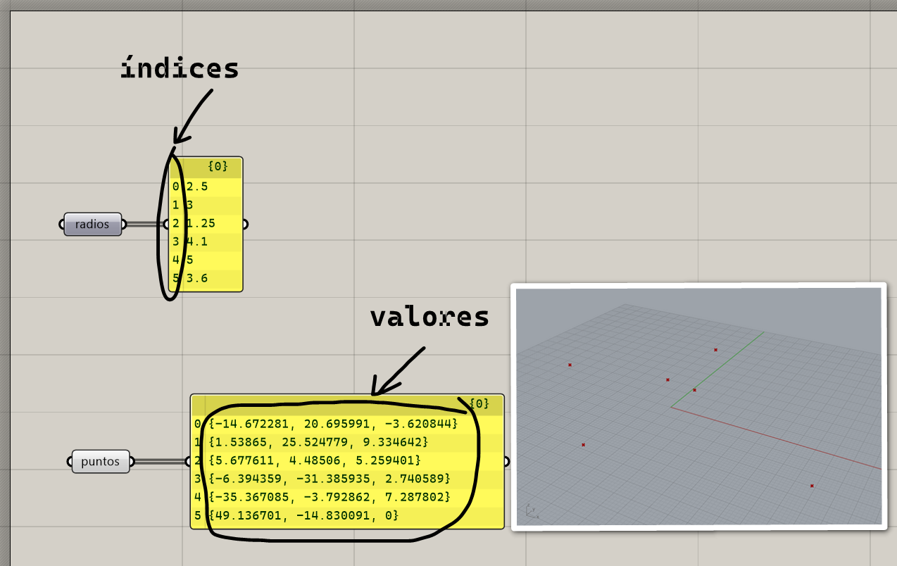

# Definición de lista

Una lista es una colección de elementos, que pueden ser números, puntos,
curvas, superficies, mallas, etc. Los elementos están en orden, y tienen
un índice que indica su posición en la lista. El índice del primero es $0$,
el del segundo es $1$, el del tercero es $2$, y así sucesivamente.

[Ejemplo: 01-listas.gh](./01-listas.gh)

[Ejercicios »](./ejercicios)

[Volver »](..)
