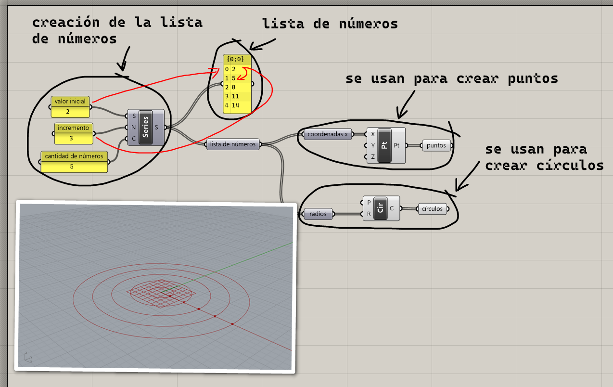
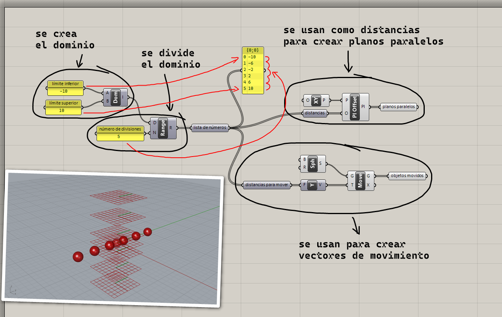
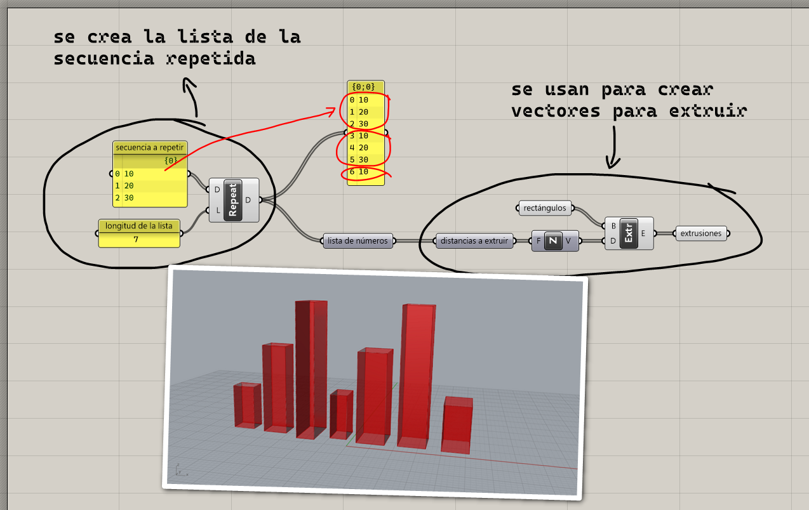
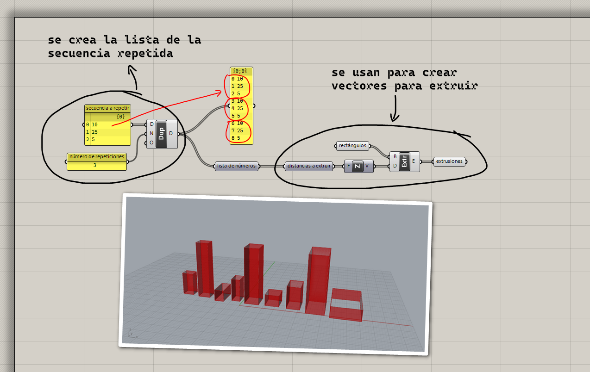

# Creación de listas

Uno de las principales maneras de crear listas, es crear una lista de números
y usarlos para crear nuevos objetos y datos. Vamos a ver algunas formas
con las que podemos crear listas de números.

## Serie de números

Por ejemplo, podemos crear una serie de números y los podríamos usar
como coordenadas $x$ para crear puntos, o como radios para crear círculos,
o para crear los objetos que queramos.

[Ejemplo: 01-numeros-consecutivos.gh](./README.md)

## División de un dominio

Otro método de crear una lista de números es dividir un dominio
en cierto número de partes iguales.

[Ejemplo: 02-dividir-dominio.gh](./02-dividir-dominio.gh)

## Repetir secuencia

Podemos repetir una secuencia de datos hasta alcanzar una longitud deseada.
La secuencia a repetir no solo puede ser una lista de números,
sino también curvas, puntos, superficies, o cualquier tipo de dato.

[Ejemplo: 03-repetir-secuencia.gh](./03-repetir-secuencia.gh)

## Repetir secuencia N veces

Otra manera de repetir una secuencia de datos es indicando el número de
repeticiones que habrá de la secuencia original.

[Ejemplo: 04-repetir-secuencia-n.gh](./04-repetir-secuencia-n.gh)

[Ejercicios »](./ejercicios)

[Volver »](..)
