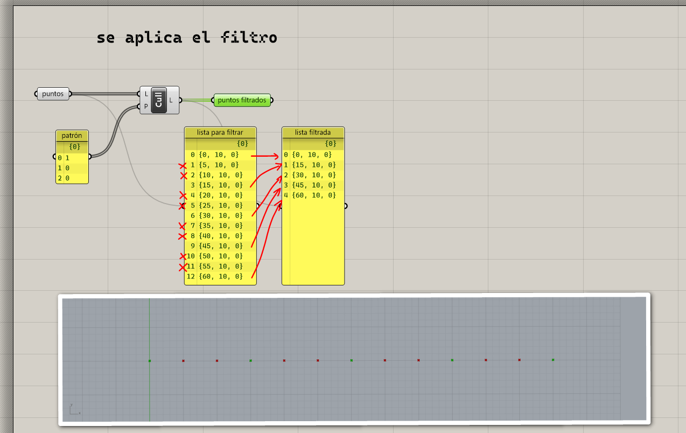

# Filtración

Muchas veces necesitamos eliminar elementos de una lista o filtrarlos
de acuerdo a algún criterio. Las formas más comunes de filtrar una lista son
definiendo un patrón, por índices o aleatoriamente.

## Filtración por patrón

Para filtrar una lista por un patrón, necesitamos otra lista de
valores booleanos que va a definir cuáles elementos se conservan y cuáles
se eliminan.

[Ejemplo: 01-patron.gh](./01-patron.gh)

Considerando que la evaluación de una condición da como resultado
un valor booleano, otra forma de crear un patrón para filtrar una lista
es con condiciones.

[Ejemplo: 02-patron-condiciones.gh](./02-patron-condiciones.gh)

## Filtración por índice

Otra manera de filtrar elementos de una lista es indicando explícitamente
los índices de los elementos que se van a eliminar.

[Ejemplo: 03-indices.gh](./03-indices.gh)

## Filtración aleatoria

Si únicamente necesitamos eliminar una cantidad de elementos de una lista
sin importar cuáles, podemos aplicar la filtración aleatoria.

[Ejemplo: 04-aleatoria.gh](./04-aleatoria.gh)

[Ejercicios »](./ejercicios)

[Volver »](..)
