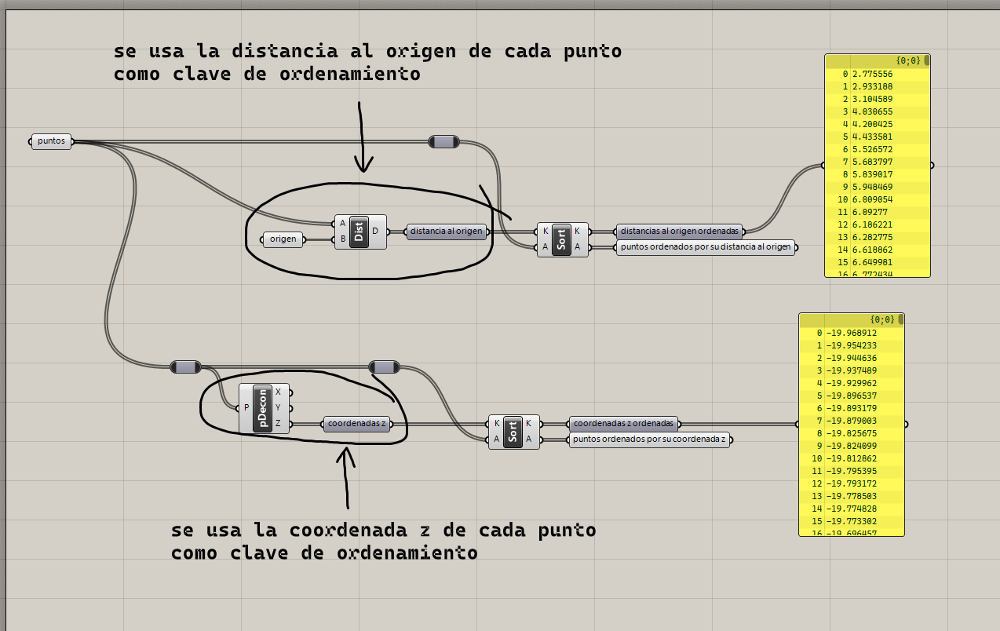
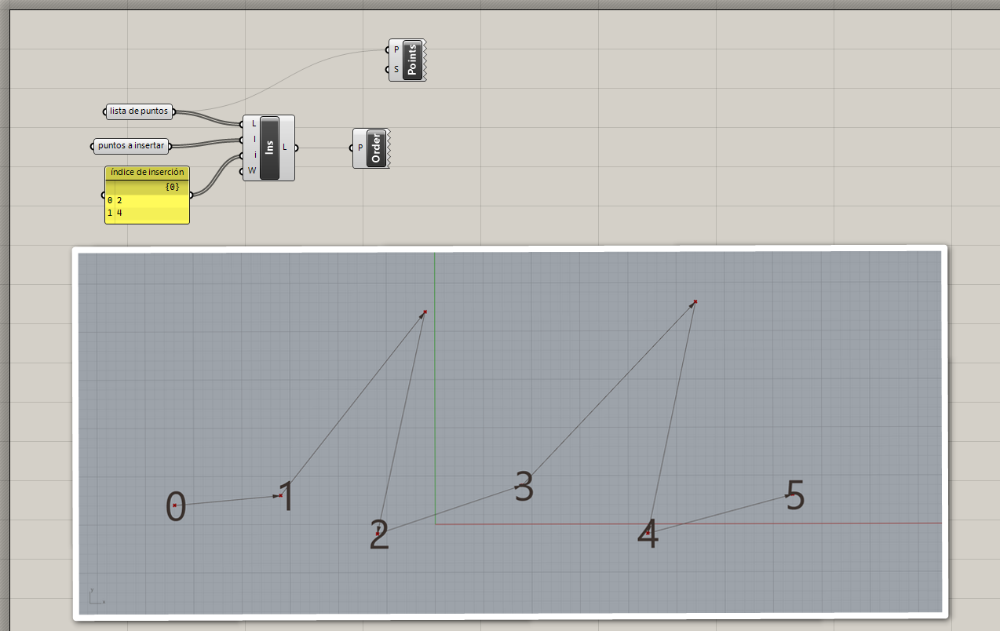
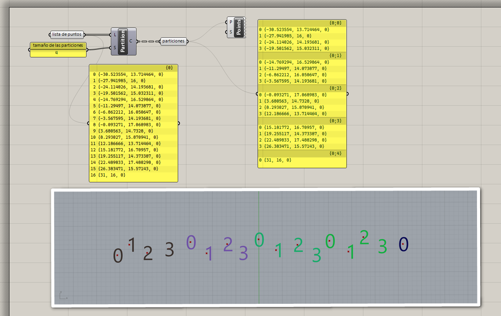
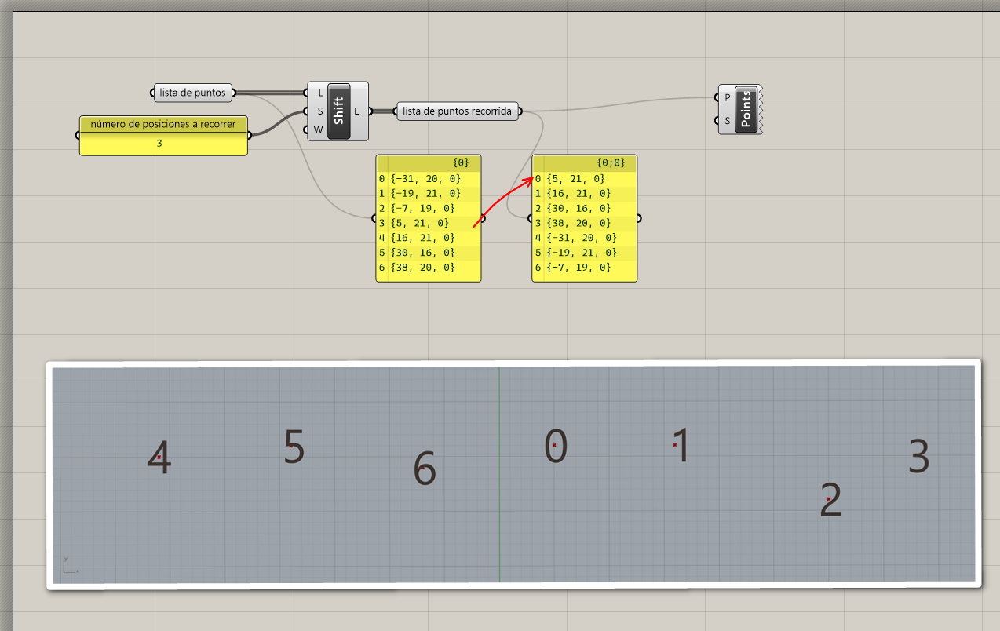
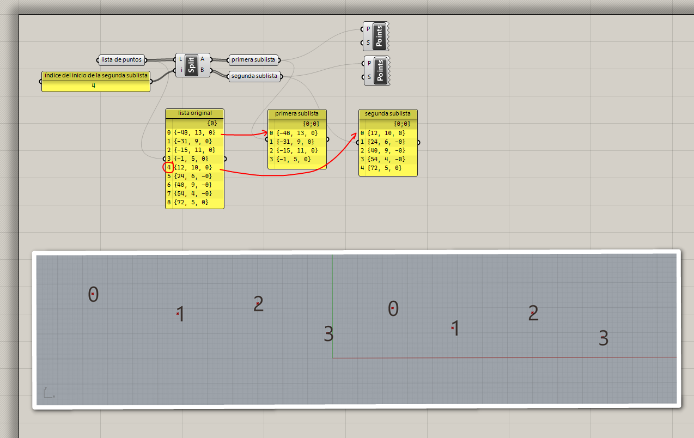
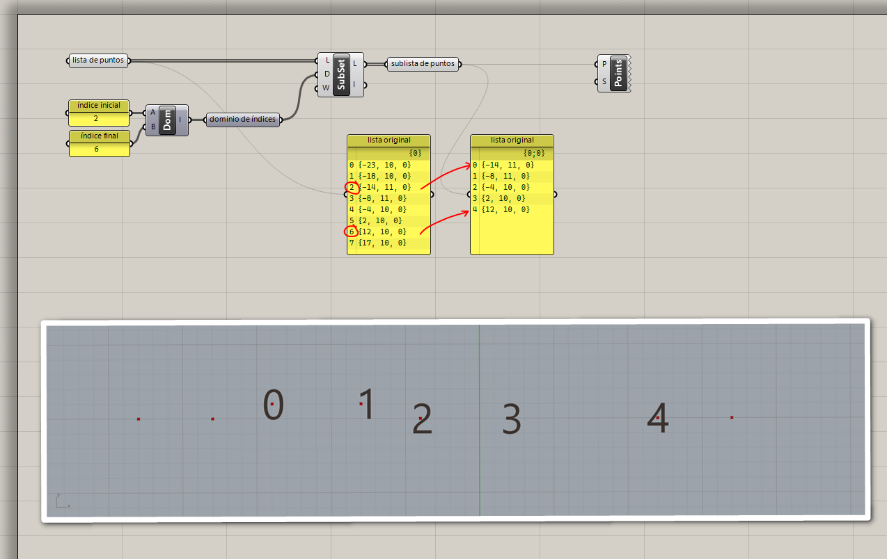

# Manipulación de listas

Es común que los datos que necesitamos se encuentren en el orden que
necesitamos o se encuentran repartidos entre varias listas.
Para estos casos, Grasshopper nos proporciona diversas operaciones para
extraer y reorganizar elementos de listas.

## Ordenar

Para ordenar los elementos de una lista, necesitamos definir un criterio
para compararlos. Comparar dos números es trivial, pero no dos puntos
o dos curvas.

Por ejemplo, si queremos ordenar puntos según su distancia al origen,
el valor numérico que se usa para determinar el orden, también llamado _clave_,
sería la distancia. Si queremos ordenar curvas según su longitud, la clave
sería la longitud.

[Ejemplo: 01-ordenar.gh](./01-ordenar.gh)

## Insertar elementos

Podemos insertar elementos a una lista indicando el índice en
el que queremos que queden.

[Ejemplo: 02-insertar.gh](./02-insertar.gh)

## Partir listas

De una lista, podemos extraer particiones o secciones de tamaño fijo.

[Ejemplo: 03-particiones.gh](./03-particiones.gh)

## Recorrer listas

Podemos hacer que el inicio de una lista sea un elemento que está
en otra posición.

[Ejemplo: 04-recorrer.gh](./04-recorrer.gh)

## Dividir listas

Si necesitamos dividir una lista en dos, solo necesitamos indicar el índice

[Ejemplo: 05-dividir.gh](./05-dividir.gh)

## Extraer sublista

Podemos extraer una porción de la lista si contamos con el rango de índices
de los elementos que necesitamos.

[Ejemplo: 06-sublista.gh](./06-sublista.gh)

[Ejercicios »](./ejercicios)

[Volver »](..)
