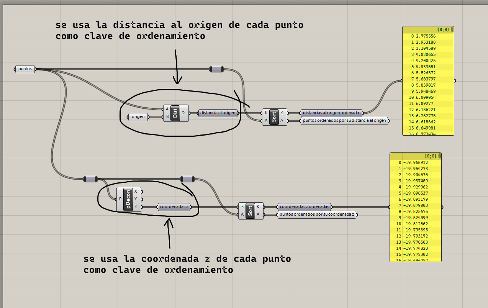

# Manipulación de listas

Es común que los datos que necesitamos se encuentren en el orden que
necesitamos o se encuentran repartidos entre varias listas.
Para estos casos, Grasshopper nos proporciona diversas operaciones para
extraer y reorganizar elementos de listas.

## Ordenamiento

Para ordenar los elementos de una lista, necesitamos definir un criterio
para compararlos. Comparar dos números es trivial, pero no dos puntos
o dos curvas.

Por ejemplo, si queremos ordenar puntos según su distancia al origen,
el valor numérico que se usa para determinar el orden, también llamado _clave_,
sería la distancia. Si queremos ordenar curvas según su longitud, la clave
sería la longitud.

[Ejemplo: 01-ordenamiento.gh](./01-ordenamiento.gh)

## Insertar elementos

Podemos insertar elementos a una lista indicando el índice en
el que queremos que queden.

[Ejemplo: 02-insertar.gh](./02-insertar.gh)

## Partir listas

De una lista, podemos extraer particiones o secciones de tamaño fijo.

[Ejemplo: 03-particiones.gh](./03-particiones.gh)

[Ejercicios »](./ejercicios)

[Volver »](..)
