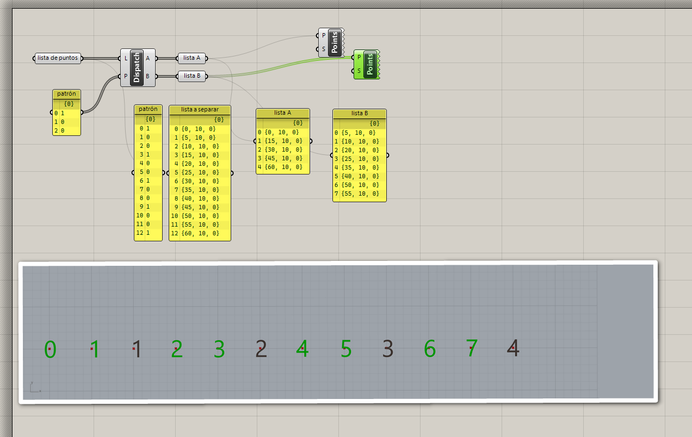
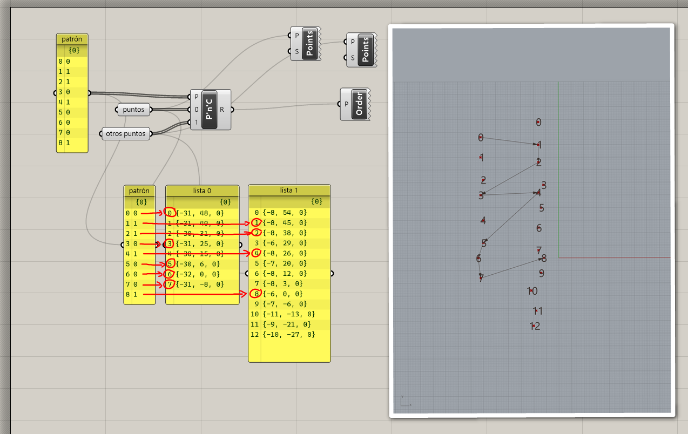
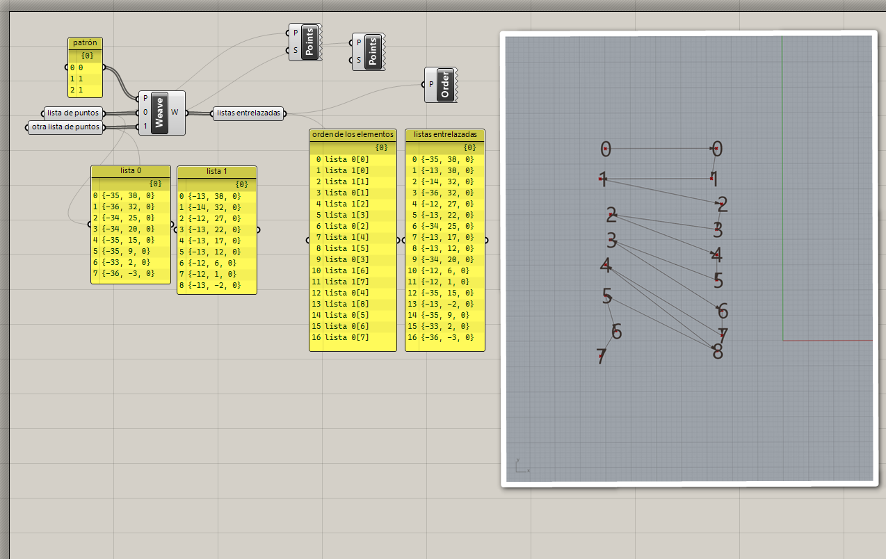

# Combinación de listas

Cuando trabajamos con listas, muchas veces tenemos datos repartidos en varias
listas y necesitamos juntarlos y organizarlos. Vamos a ver algunos métodos
con los que podemos hacer esto.

## Separar elementos

Tenemos una lista y queremos separar los elementos en dos listas.
Definimos un patrón para elegir qué elementos van en cada lista.

[Ejemplo: 01-separar.gh](./01-separar.gh)

## Seleccionar elementos

Tenemos dos listas y queremos generar una sola lista con elementos de ambas.
Definimos un patrón para seleccionar de qué lista queremos seleccionar
los elementos.

[Ejemplo: 02-seleccionar.gh](./02-seleccionar.gh)

## Entrelazar elementos

Tenemos dos listas y queremos generar una sola con todos los elementos de ambas.
Definimos un patrón para indicar el orden en el que se agregarán los
elementos a la lista resultante.

[Ejemplo: 03-entrelazar.gh](./03-entrelazar.gh)

[Ejercicios »](./ejercicios)

[Volver »](..)
