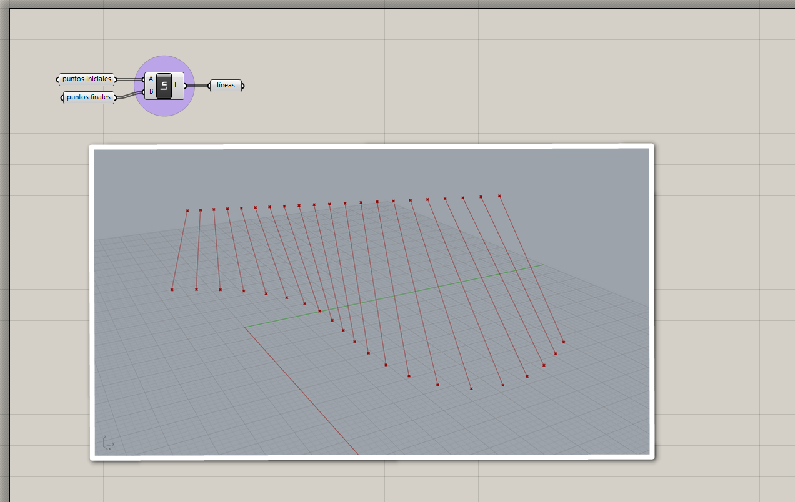
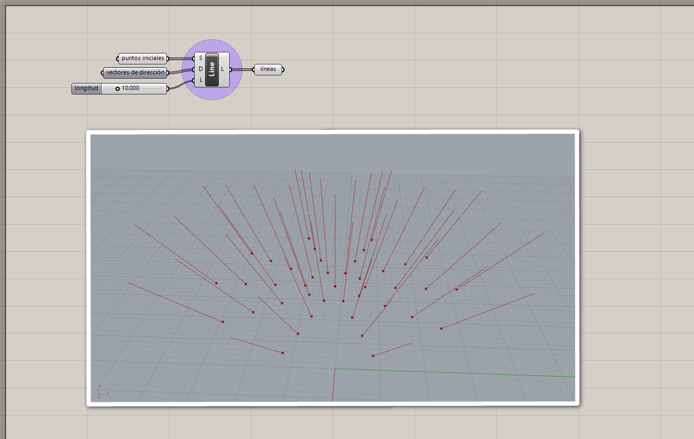
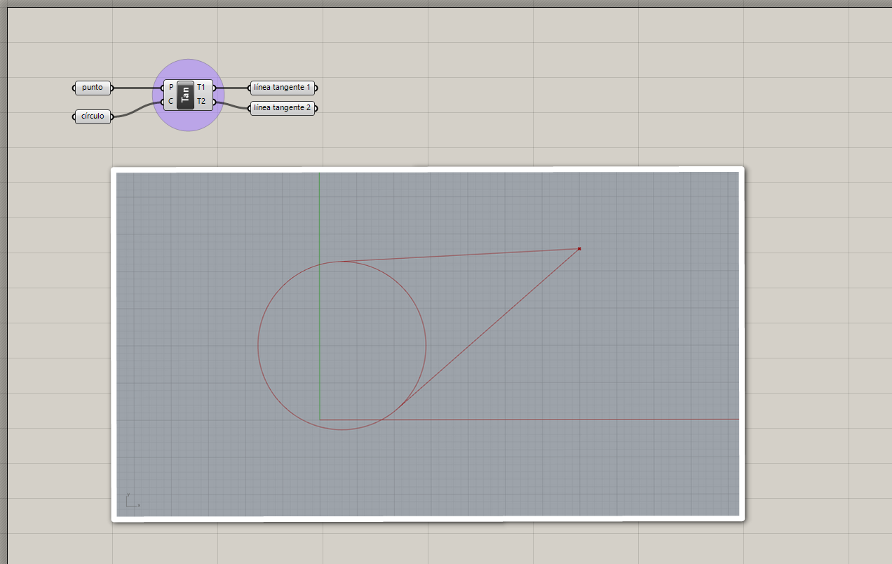
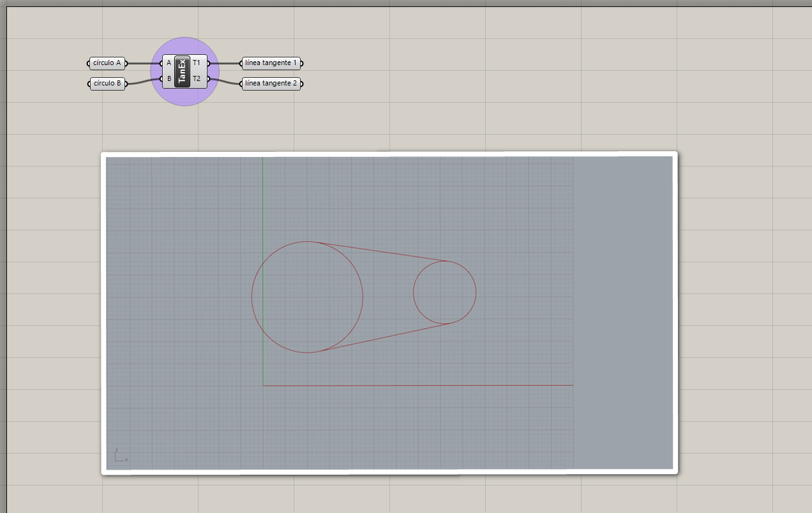
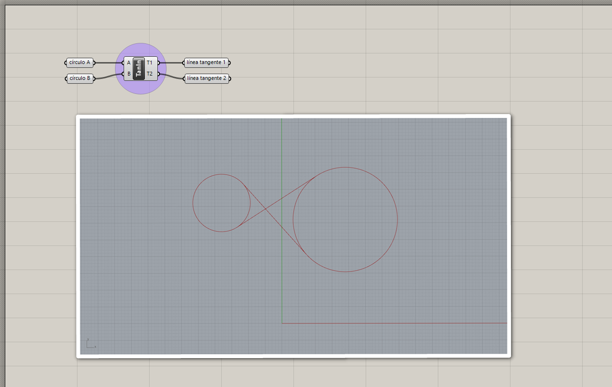

# Curvas primitivas

Las curvas primitivas son curvas con formas geométricas básicas.
Podemos crearlas de diferentes maneras según los datos con los que contamos.

## Líneas

### Línea entre dos puntos

[Ejemplo: 01-linea-dos-puntos.gh](./01-linea-dos-puntos.gh)

### Línea desde origen, dirección y longitud (SDL)

[Ejemplo: 02-linea-sdl.gh](./02-linea-sdl.gh)

### Líneas tangentes

Líneas tangentes desde un punto.

[Ejemplo: 03-linea-tangente-desde-punto.gh](./03-lineas-tangentes-desde-punto.gh)

Líneas tangentes externas entre círculos.

[Ejemplo: 04-lineas-tangentes-externas.gh](./04-lineas-tangentes-externas.gh)

Líneas tangentes internas entre círculos.

[Ejemplo: 05-lineas-tangentes-internas.gh](./05-lineas-tangentes-internas.gh)

## Círculo

### Círculo desde plano base y radio

[Ejemplo: 06-circulo-base-radio.gh](./06-circulo-base-radio.gh)

### Círculo desde tres puntos

[Ejemplo: 04-circulo-tres-puntos.gh](./04-circulo-tres-puntos.gh)

[Ejercicios »](./ejercicios)

[Volver »](..)
