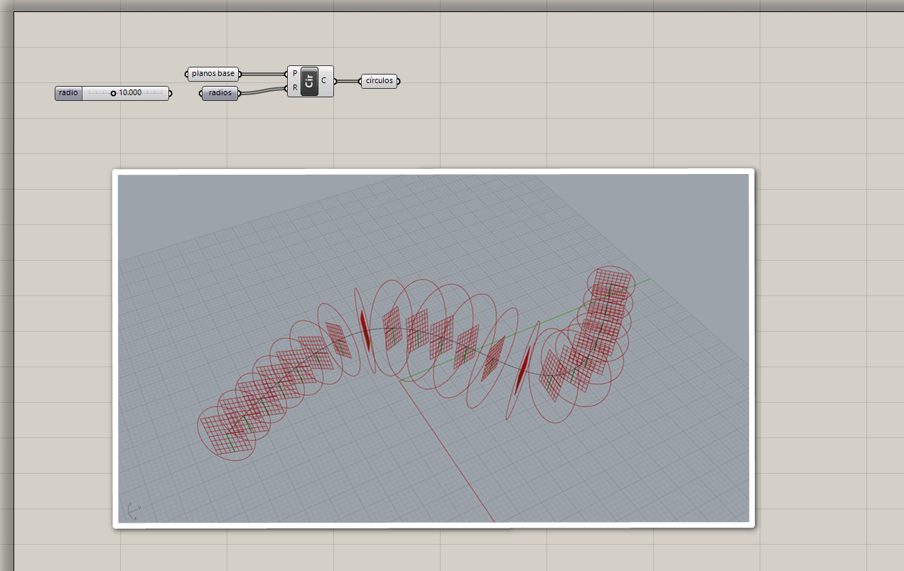
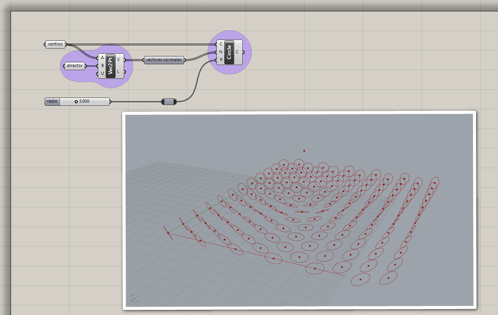
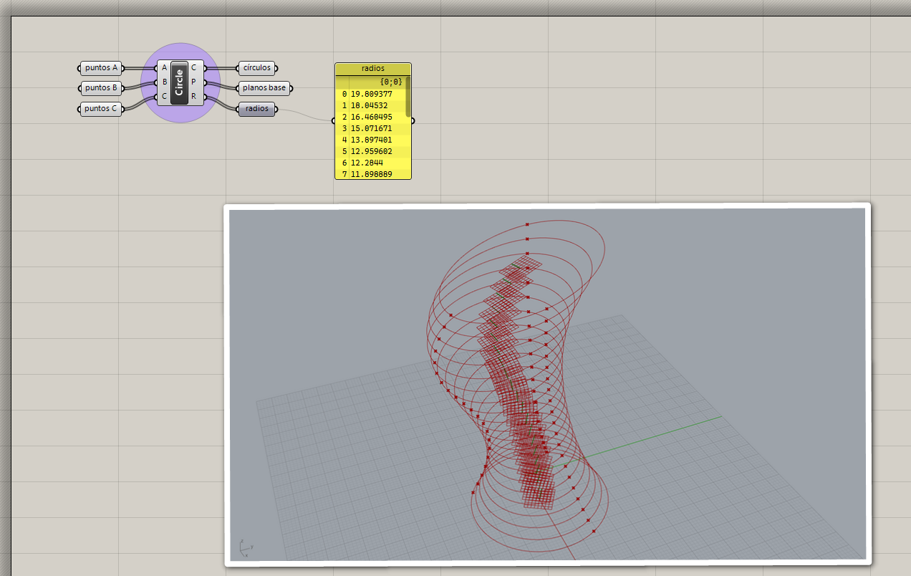
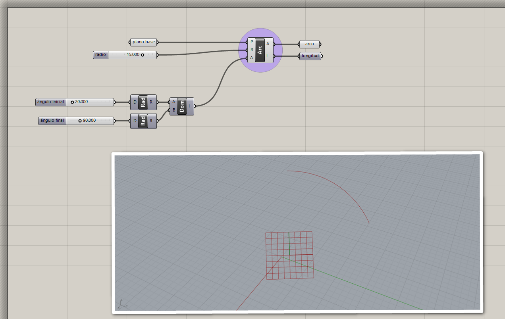
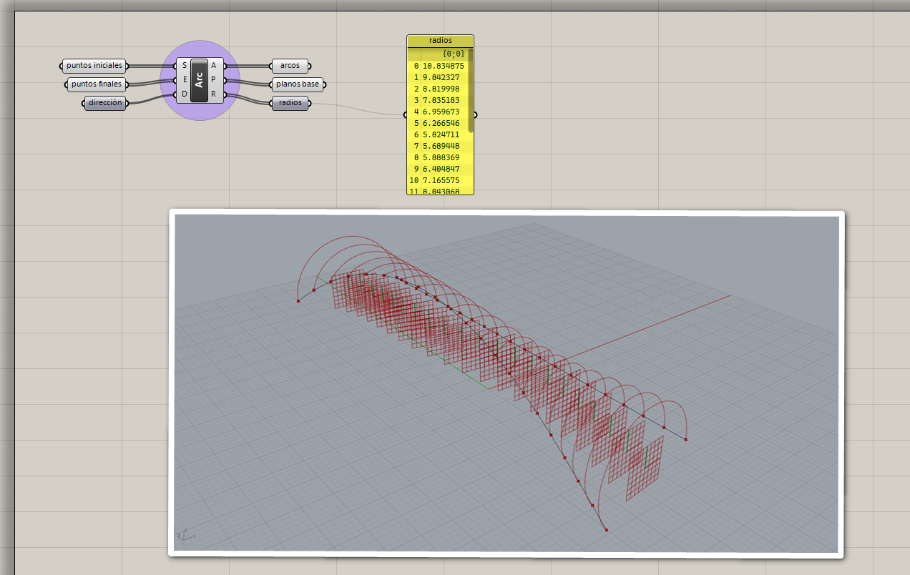
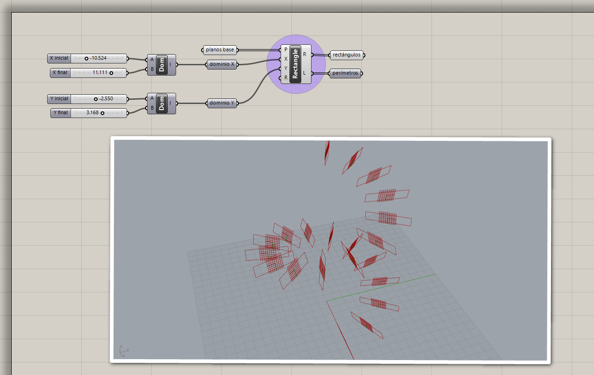
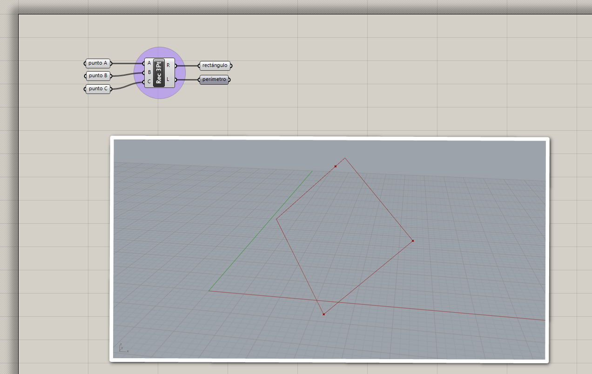
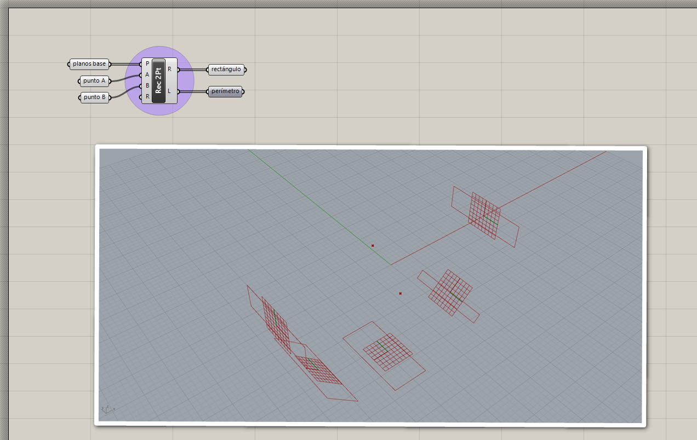
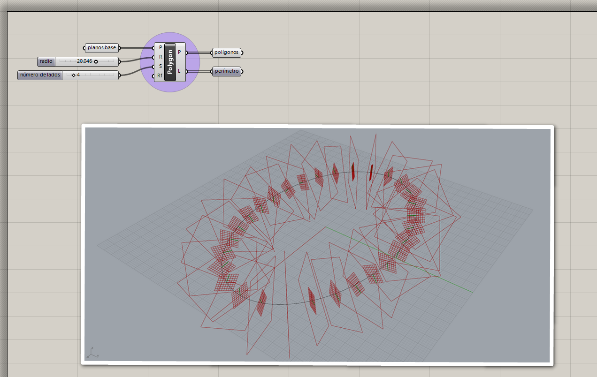
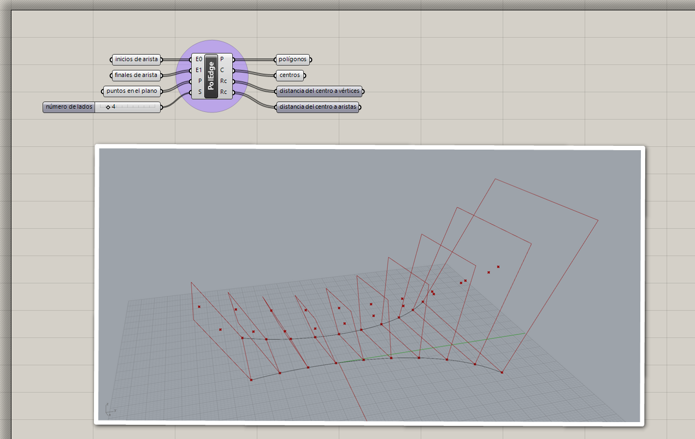

# Curvas primitivas

Las curvas primitivas son curvas con formas geométricas básicas.
Podemos crearlas de diferentes maneras según los datos con los que contamos.

## Líneas

### Línea entre dos puntos

[Ejemplo: 01-linea-dos-puntos.gh](./01-linea-dos-puntos.gh)

### Línea desde origen, dirección y longitud (SDL)

[Ejemplo: 02-linea-sdl.gh](./02-linea-sdl.gh)

### Líneas tangentes

Líneas tangentes desde un punto.

[Ejemplo: 03-linea-tangente-desde-punto.gh](./03-lineas-tangentes-desde-punto.gh)

Líneas tangentes externas entre círculos.

[Ejemplo: 04-lineas-tangentes-externas.gh](./04-lineas-tangentes-externas.gh)

Líneas tangentes internas entre círculos.

[Ejemplo: 05-lineas-tangentes-internas.gh](./05-lineas-tangentes-internas.gh)

## Círculos

### Círculo desde radio

Círculo desde plano base y radio.

[Ejemplo: 06-circulo-base-radio.gh](./06-circulo-base-radio.gh)

Círculo desde centro, vector normal y radio.

[Ejemplo: 07-circulo-cnr.gh](./07-circulo-cnr.gh)

### Círculo desde tres puntos

[Ejemplo: 08-circulo-tres-puntos.gh](./08-circulo-tres-puntos.gh)

## Arcos

### Arco desde plano base, radio y ángulo

[Ejemplo: 09-arco-plano-radio-angulo.gh](./09-arco-plano-radio-angulo.gh)

### Arco desde tres puntos

[Ejemplo: 10-arco-tres-puntos.gh](./10-arco-tres-puntos.gh)

### Arco desde inicio, final y dirección

[Ejemplo: 11-arco-sed.gh](./11-arco-sed.gh)

## Rectángulos

### Rectángulo desde plano base y dominios

[Ejemplo: 12-rectangulo-plano-dominios.gh](./12-rectangulo-plano-dominios.gh)

### Rectángulo desde tres puntos

[Ejemplo: 13-rectangulo-tres-puntos.gh](./13-rectangulo-tres-puntos.gh)

### Rectángulo desde dos puntos

[Ejemplo: 14-rectangulo-dos-puntos.gh](./14-rectangulo-dos-puntos.gh)

## Polígonos

### Polígono desde plano base, radio y número de lados

[Ejemplo: 15-poligono-plano-radio-lados.gh](./15-poligono-plano-radio-lados.gh)

### Polígono desde arista, plano y número de lados

[Ejemplo: 16-poligono-arista-plano-lados.gh](./16-poligono-arista-plano-lados.gh)

[Volver »](..)
