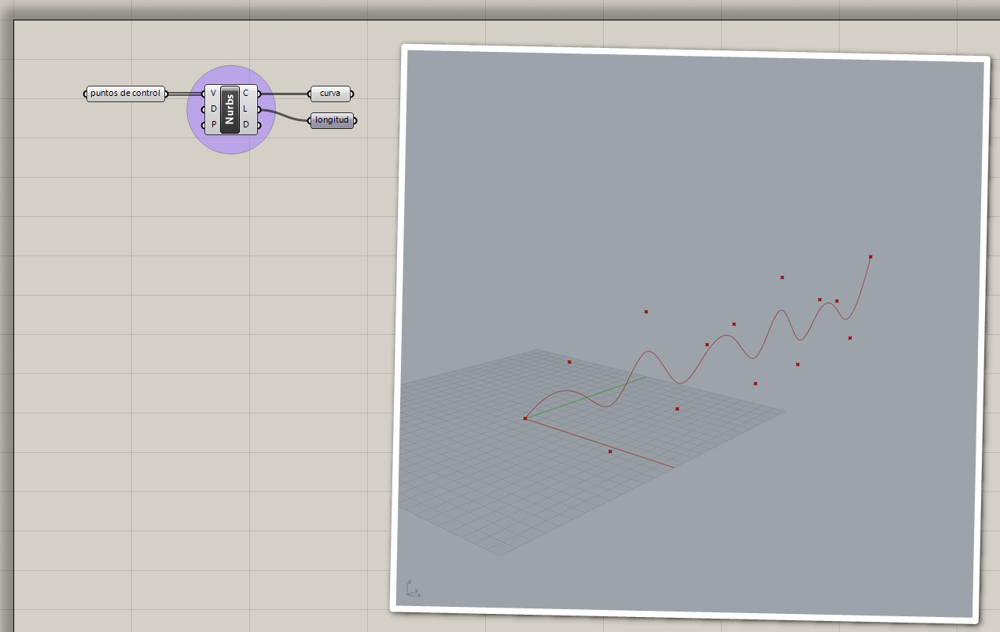

# Curvas de forma libre

Las curvas primitivas muchas veces no son suficientes para conseguir la
geometría que necesitamos. En estos casos, podemos utilizar las curvas de
forma libre.

## Polilínea

Una polilínea es una secuencia de líneas rectas conectadas por sus puntos
de inicio y final.

[Ejemplo: 01-polilinea.gh](./01-polilinea.gh)
|

## Curva de interpolación de puntos

Una curva de interpolación de puntos pasa exactamente por los puntos que
se proporcionan.

[Ejemplo: 02-interpolar.gh](./02-interpolar.gh)

## Curva NURBS

Podemos crear curvas NURBS proporcionando los puntos de control.

[Ejemplo: 03-nurbs.gh](./03-nurbs.gh)

[Ejercicios »](./ejercicios)

[Volver »](..)
