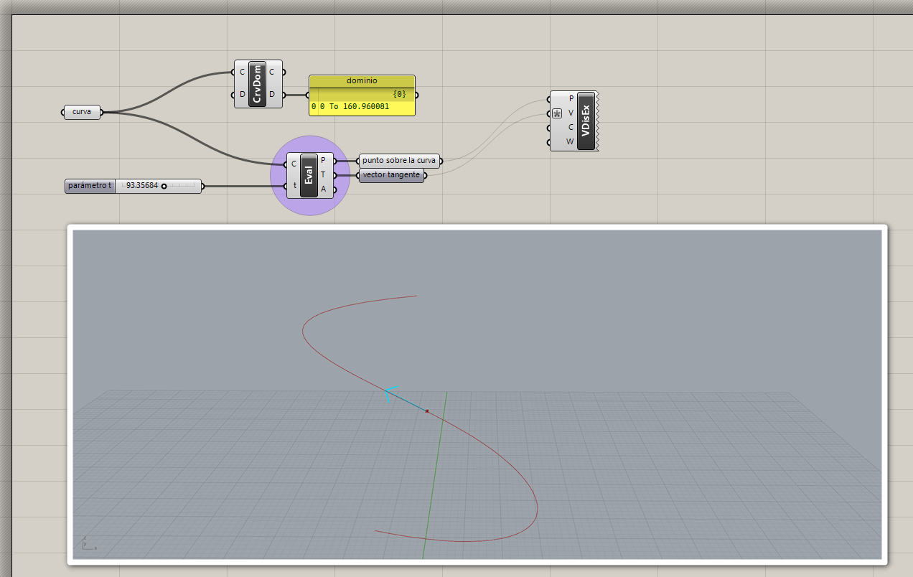
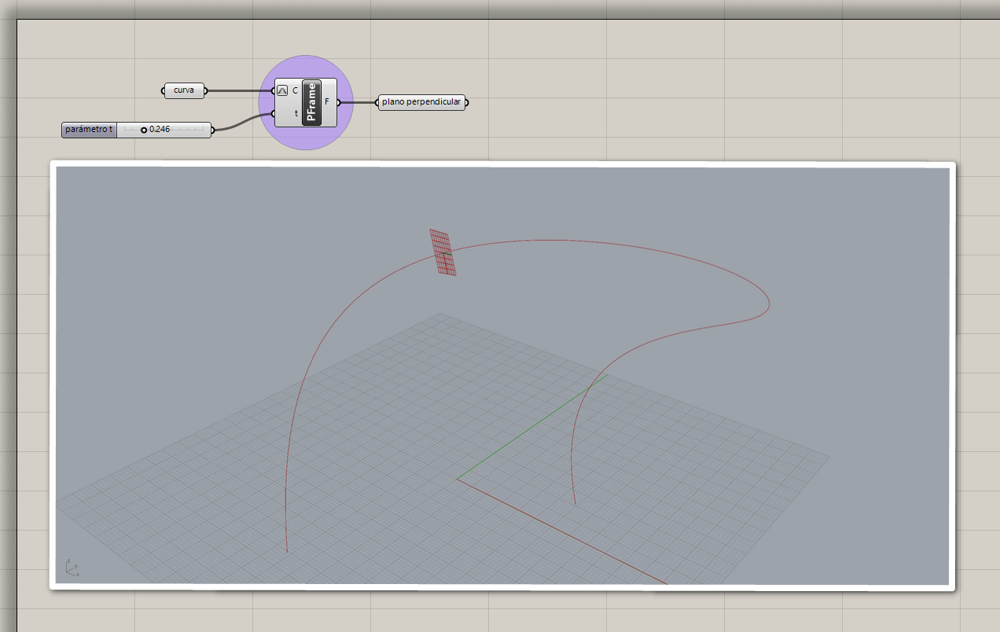
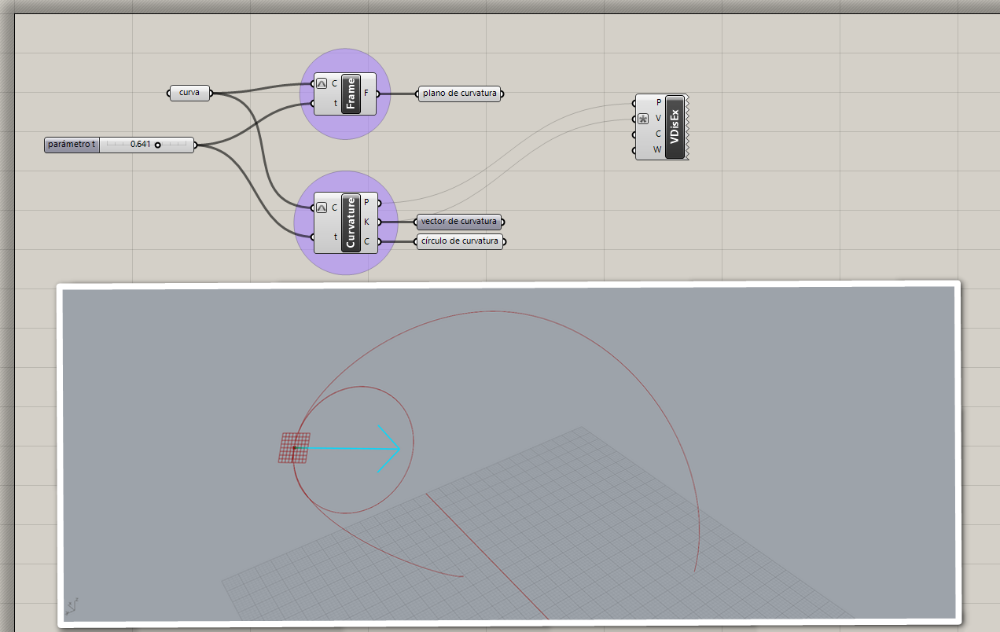

# Evaluación de curvas

Podemos extraer datos de algún punto a lo largo de una curva. Para esto,
las curvas tienen un dominio asociado, donde el límite inferior corresponde
al inicio de la curva, y el límite superior corresponde al final.
Si tenemos un número dentro de este dominio, podemos hacer la evaluación
de la curva en esa posición.

## Punto sobre curva

[Ejemplo: 01-punto-sobre-curva.gh](./01-punto-sobre-curva.gh)

## Plano perpendicular

[Ejemplo: 02-plano-perpendicular.gh](./02-plano-perpendicular.gh)

## Curvatura

[Ejemplo: 03-curvatura.gh](./03-curvatura.gh)

[Ejercicios »](./ejercicios)

[Volver »](..)
