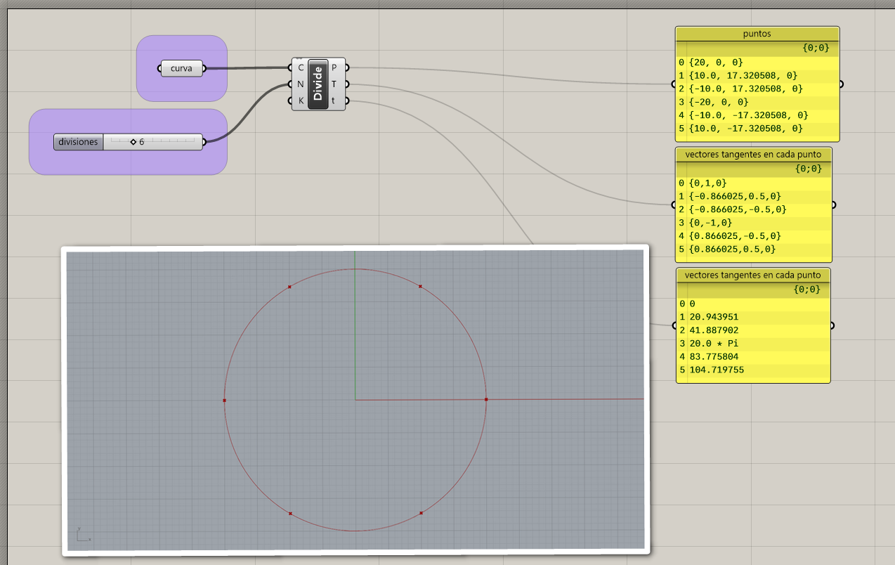

# División de curvas

Contamos con diferentes maneras de crear objetos distribuidos a lo largo
de una curva.

## Dividir curva en segmentos

Podemos crear puntos a lo largo de una curva distribuidos en segmentos
de la misma longitud.

[Ejemplo: 01-dividir-curva.gh](./01-dividir-curva.gh)
