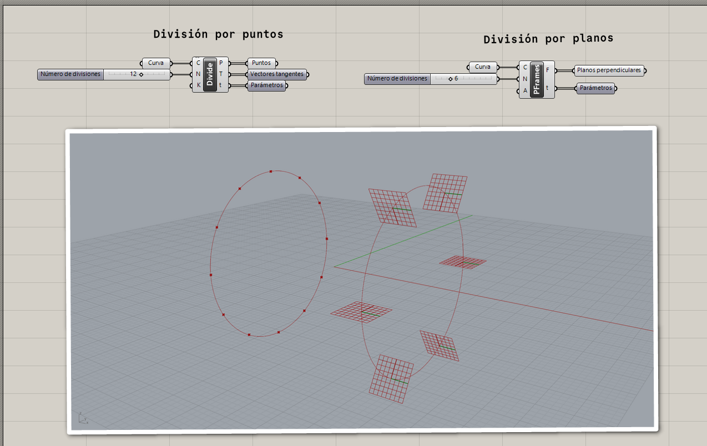
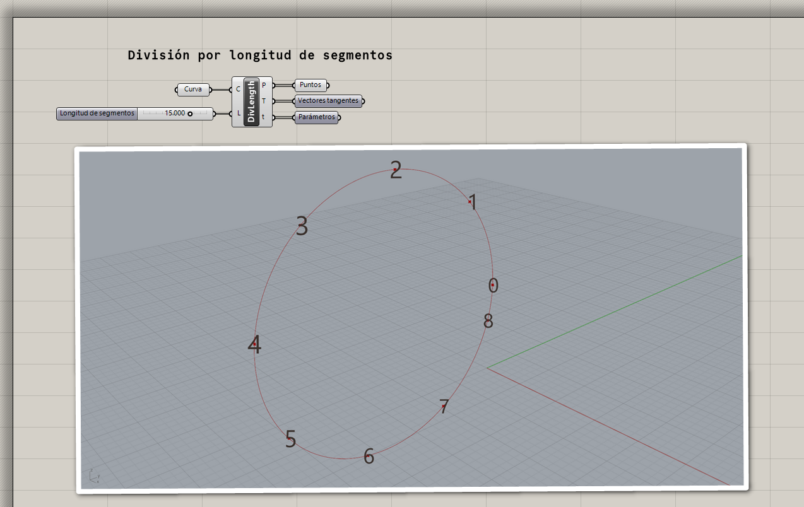

# División de curvas

Contamos con diferentes maneras de crear objetos distribuidos a lo largo
de una curva.

## Dividir en segmentos de igual longitud

Podemos dividir una curva en una cantidad de segmentos iguales.

[Ejemplo: 01-division-segmentos-iguales.gh](./01-division-segmentos-iguales.gh)

## Dividir por longitud de segmentos

Otra manera de dividir una curva es en segmentos de una longitud especificada.

[Ejemplo: 02-division-por-longitud-de-segmentos.gh](./02-division-por-longitud-de-segmentos.gh)
