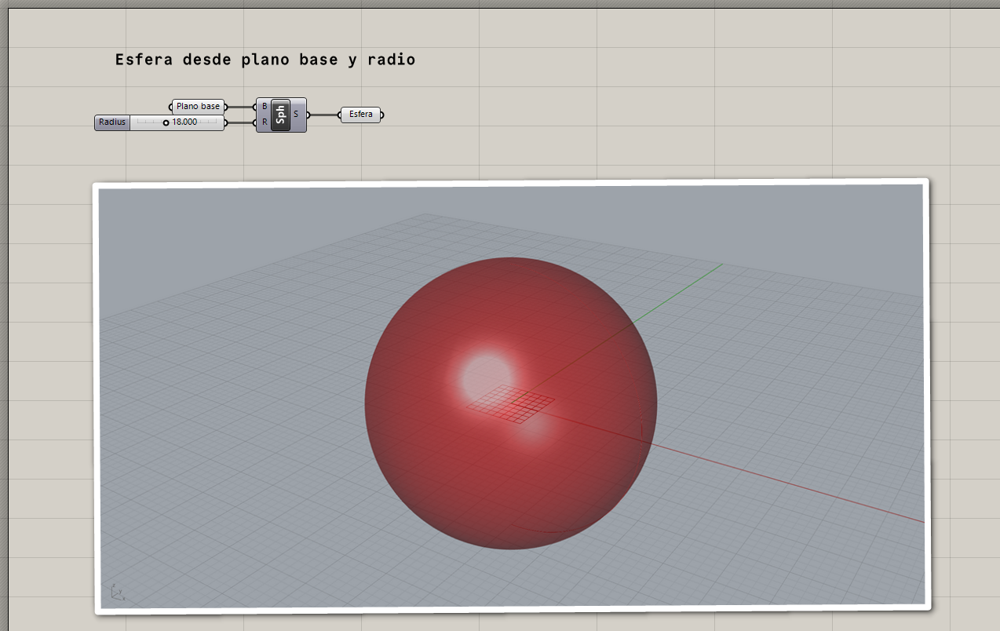
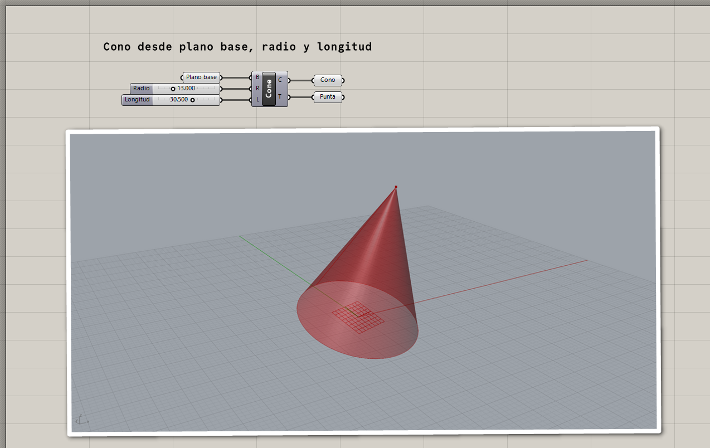
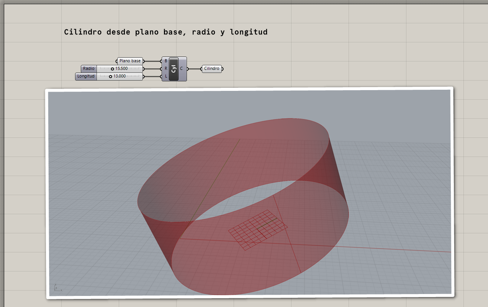
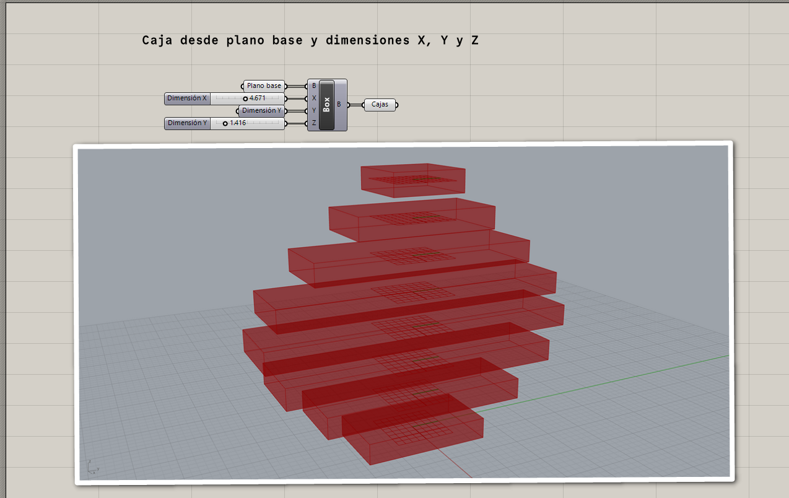
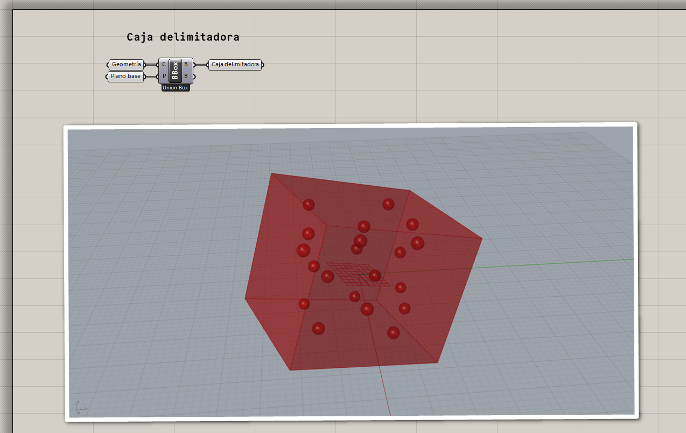
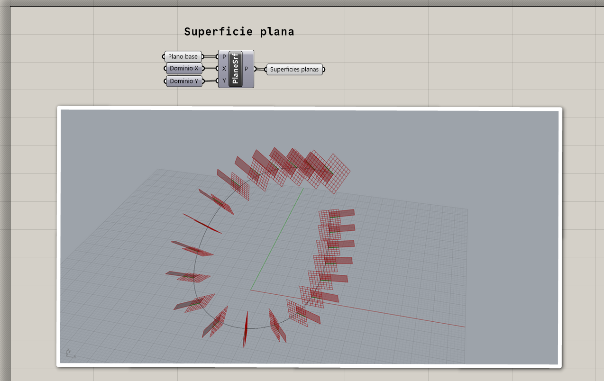

# Superficies primitivas

## Esferas

[Ejemplo: 01-esfera.gh](./01-esfera.gh)

## Cono

[Ejemplo: 02-cono.gh](./02-cono.gh)

## Cilindro

[Ejemplo: 03-cilindro.gh](./03-cilindro.gh)

## Caja

[Ejemplo: 04-caja-centro.gh](./04-caja-centro.gh)

[Ejemplo: 05-caja-delimitadora.gh](./05-caja-delimitadora.gh)

## Superficie plana

[Ejemplo: 06-superficie-plana.gh](./06-superficie-plana.gh)
