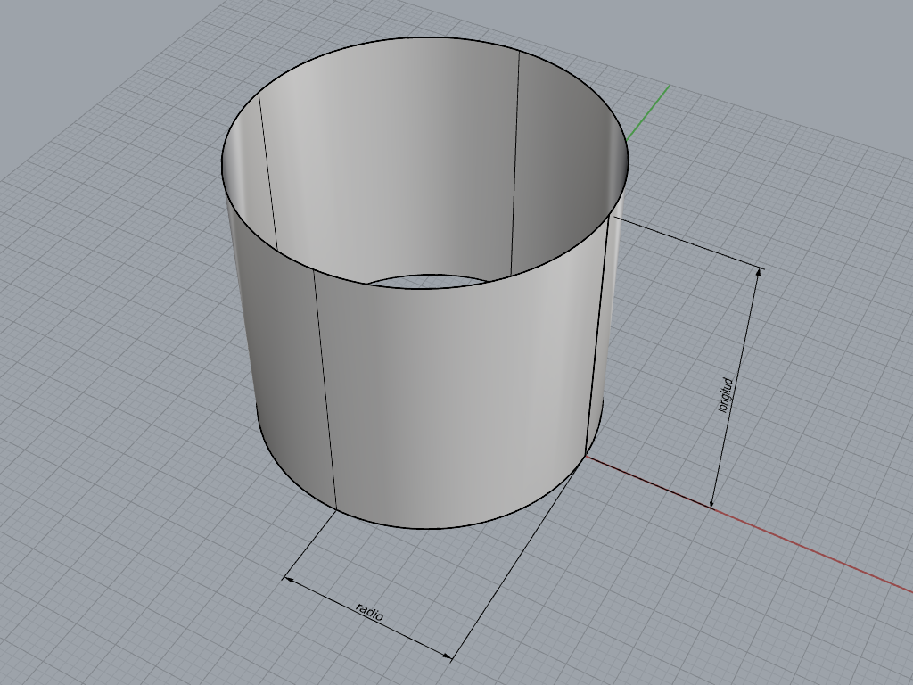
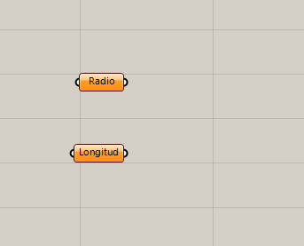
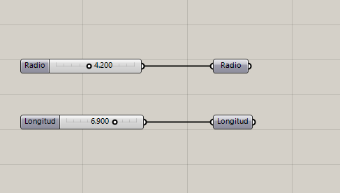
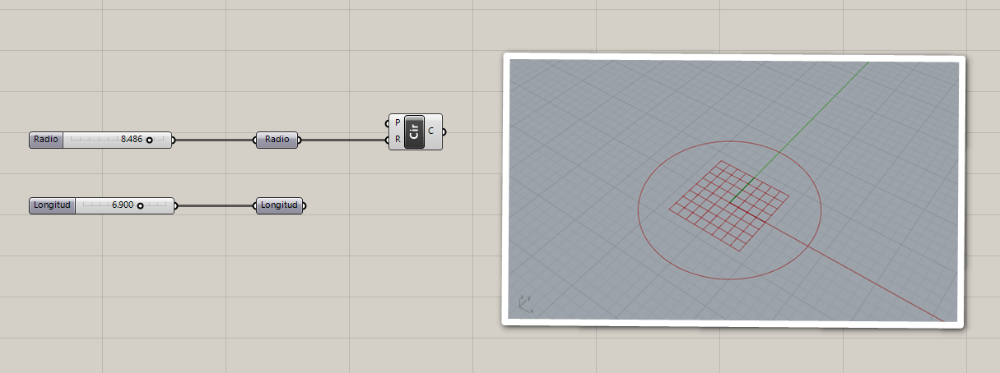
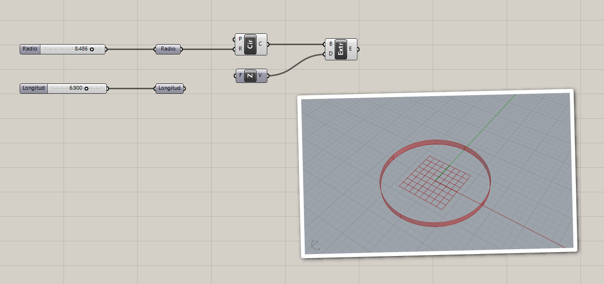
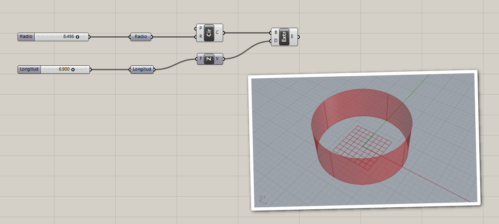

# Cilíndro

Para crear un objeto, debemos determinar qué **parámetros** lo caracterizan.
En el caso de un cilíndro, serían su **longitud** y su **radio**.

La longitud y un radio son números, así que ponemos en el lienzo un número
que represente a cada uno de estos parámetros y los etiquetamos.

Para asignarle un valor a cada uno de los parámetros,
creamos un deslizador de números.

Creamos un círculo con el radio que definimos para que sea la base.

Extruimos la base en la direcicón Z para crear la superficie.

Utilizamos la longitud que definimos para asignar la longitud
del vector de extrusión

[Volver »](..)
