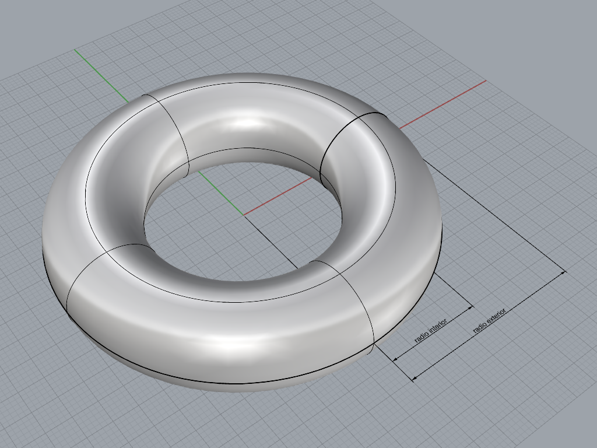
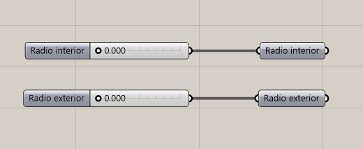
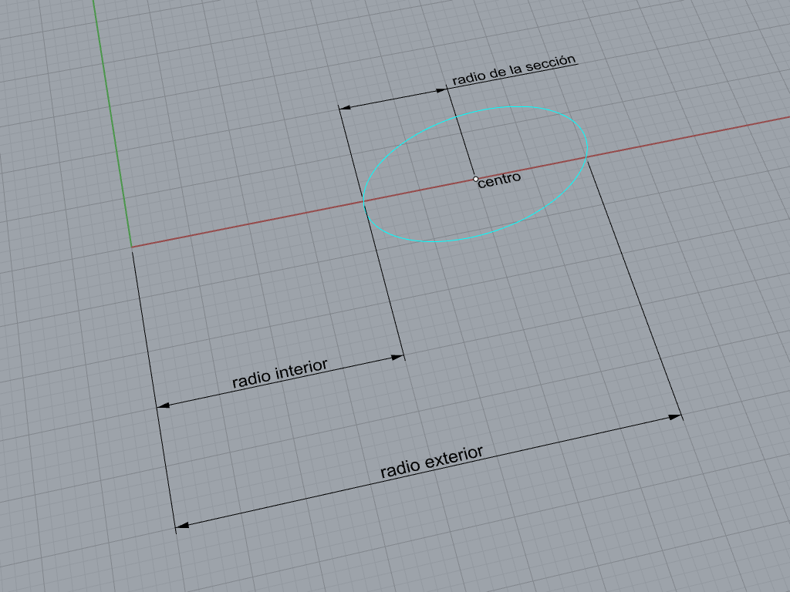
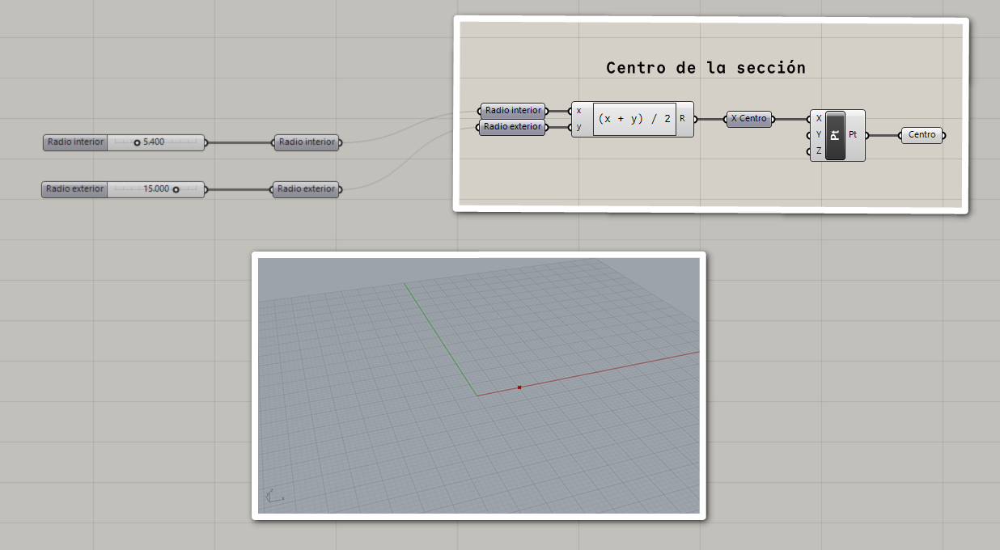
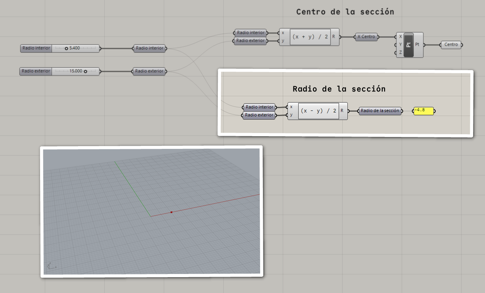
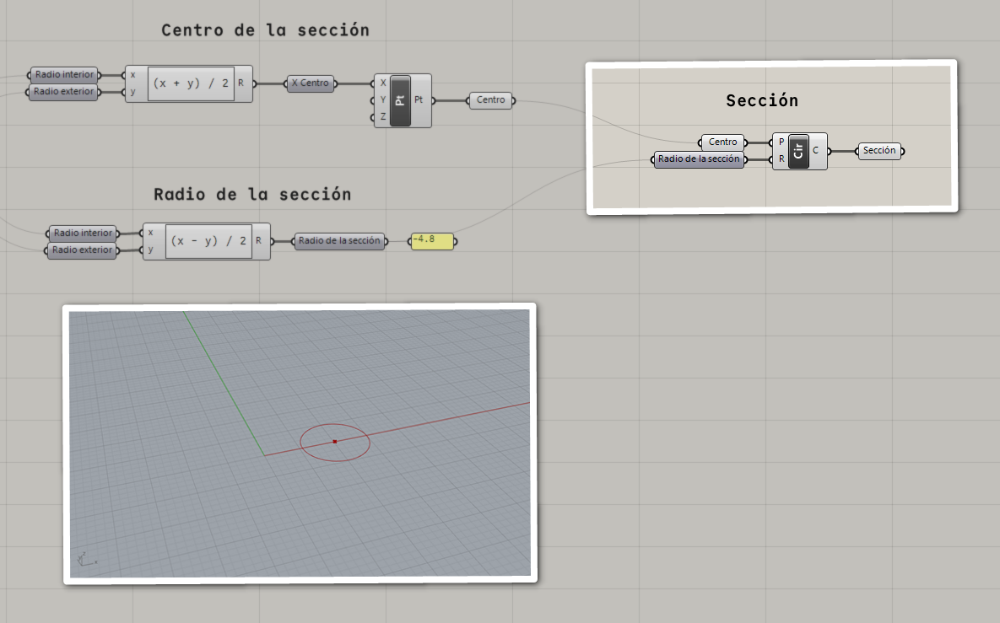
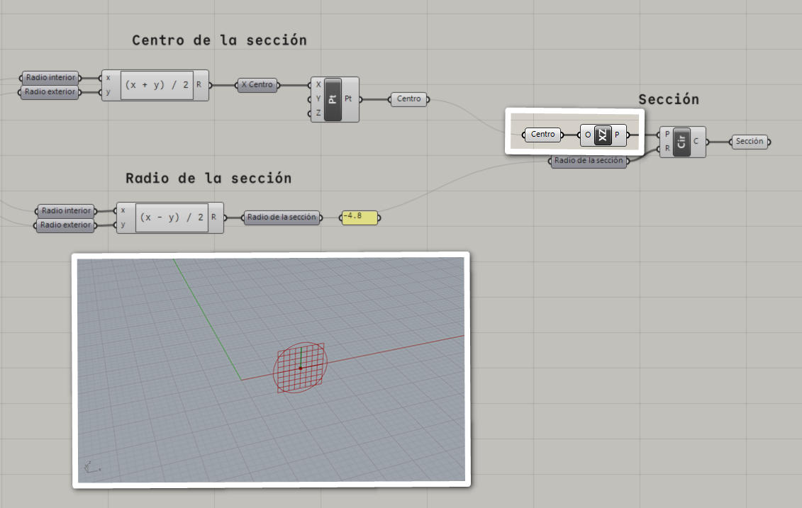
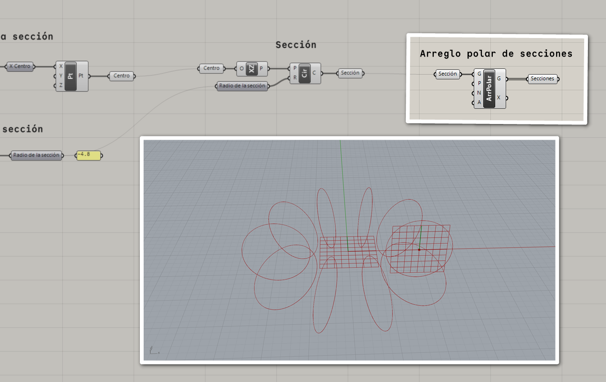
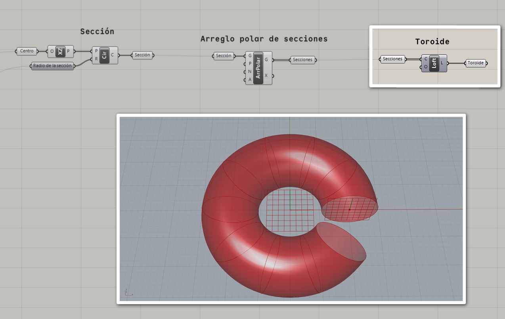
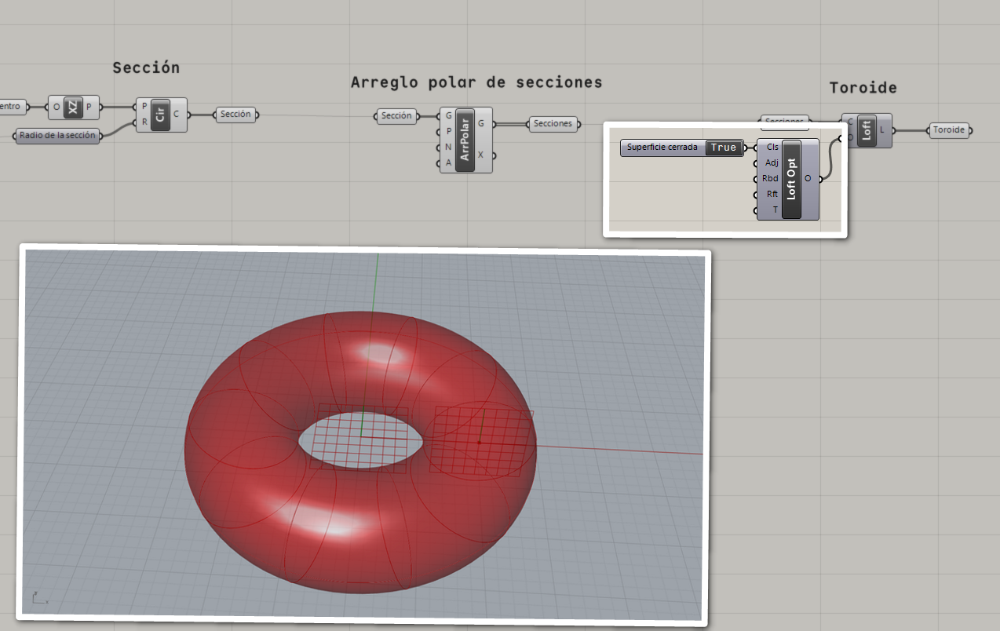

# Toroide

Una manera de caracterizar un toriode es definiendo su **radio interior**
y **radio exterior**.



Ponemos en el lienzo nuestros parámetros: el radio interior
y el radio exterior.



Podemos crear el toroide como una superficie de revolución,
para lo que necesitamos una sección de la superficie,
que tiene forma circular.



El centro de la sección es un valor derivado del radio interior
y el radio exterior.

```
centro = punto(x_centro, 0, 0)
x_centro = promedio(radio_interior, radio_exterior)
```



El radio de la sección también se deriva de los parámetros iniciales.

```
radio = (radio_exterior - radio_interior) / 2
```



Con estos datos, podemos crear el círculo de la sección.



Para corregir la orientación del círculo,
creamos un plano XZ en el centro de la sección,
y lo usamos como base para el círculo.



Ahora podemos crear un arreglo polar de la sección para obtener la forma
general del toroide.



Con el arreglo de las secciones, creamos una superficie de transición.



Modificamos las opciones de la superficie de transición para crear una
superficie cerrada.


