# _Graph mapper_

Para crear la siguiente superficie, necesitamos definir su altura.
Ya que tiene diferentes radios, no podemos definir un radio como un parámetro.

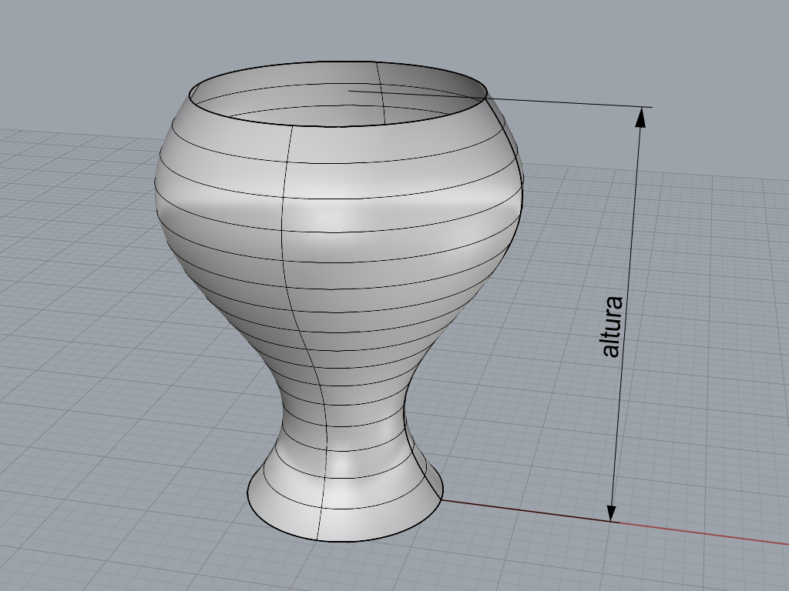

Podemos intuir que la superficie se puede crear a partir de círculos apilados
en la dirección Z, cada uno de radio distinto de modo que se forme la silueta
de la superficie.
La cantidad de círculos sí la podemos definir como un parámetro,
que es un número entero.

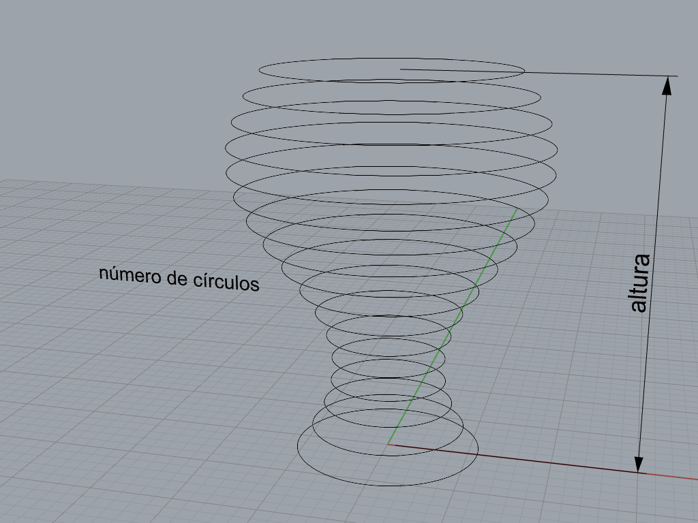

Ponemos en el lienzo los parámetros: altura (número real)
y número de círculos (número entero).

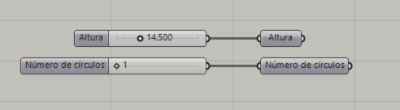

Para construir los círculos, necesitamos definir la base de cada uno.
Ya que la orientación de los círculos es horizontal,
podemos usar puntos como base.

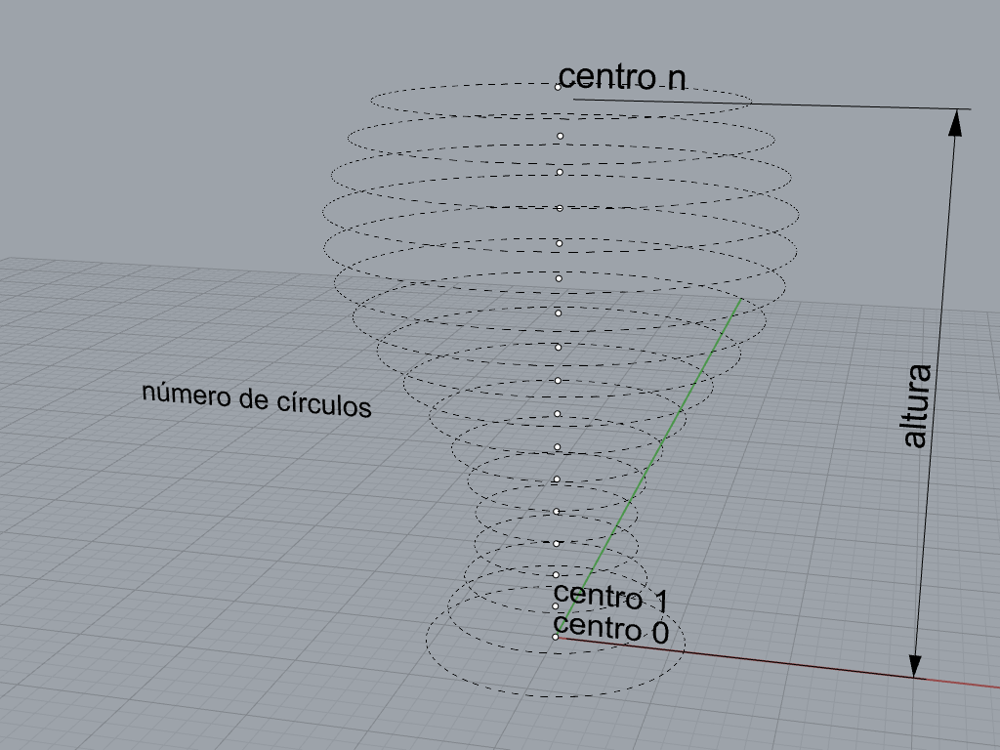

La coordenada Z del centro 0 es 0, y la del último centro es igual a la altura
que definimos al inicio. Vamos a definir un dominio delimitado por estos
dos valores, y lo dividimos uniformemente para obtener la coordenada Z
de todos los demás centros.

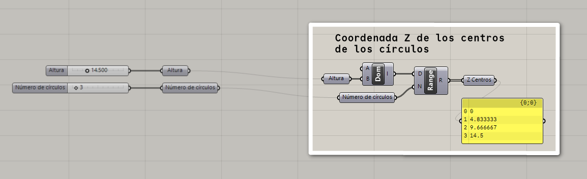

En este ejemplo, en el número de círculos tenemos el 3,
pero en la lista vemos que tenemos 4 valores, por lo que tendríamos 4 círculos.
Esto es porque, al dividir un dominio, la canditad de número que obtenemos
es igual al número de divisiones menos 1.

Para corregirlo, agregamos una expresión que decremente en uno
el número de círculos.

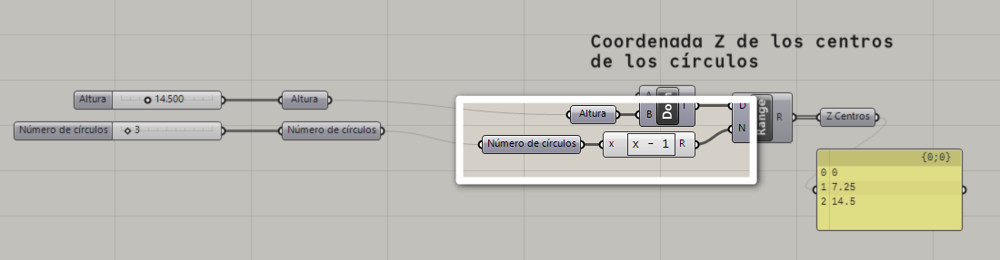

Teniendo la coordenada Z de los centros, podemos contruir los centros
y los círculos (incrementamos el número de círculos).

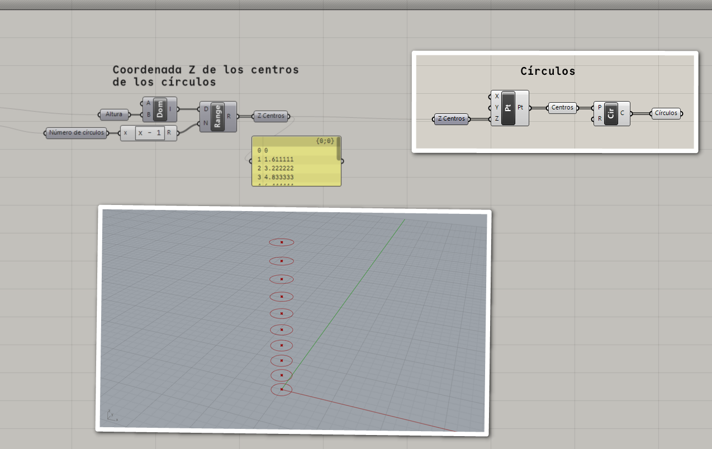

Para definir los radios de los círculos, vamos a utilizar una función
que geométricamente describa la silueta.

Creamos una lista de número uniformemente distribuidos (uno para cada círculo).
Al evaluar la función en cada uno de estos números, obtendremos el radio.

La manera más fácil es partir de un dominio de 0 a 1, que dividiremos en
la misma cantidad de divisiones que utilizamos para crear los círculos,
que calculamos previamente.

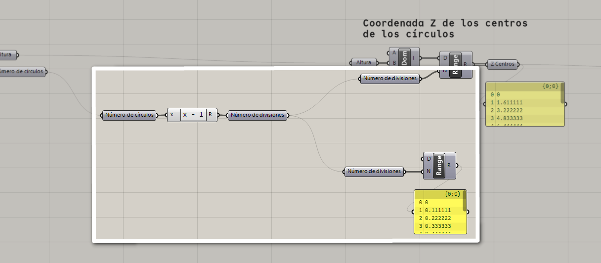

Ahora utilizamos el componente _Graph mapper_ para evaluar la función en
cada uno de estos valores y obtener los radios.

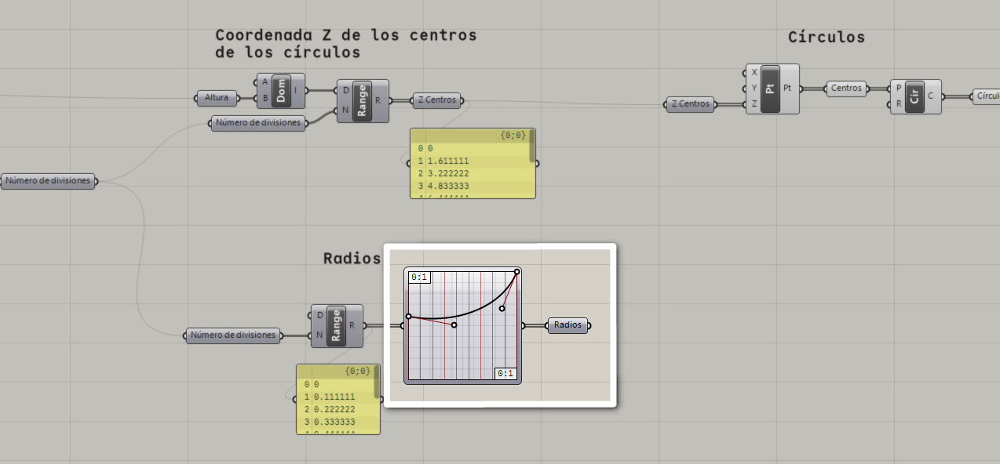

Conectamos los radios obtenidos en los círculos que creamos anteriormente.

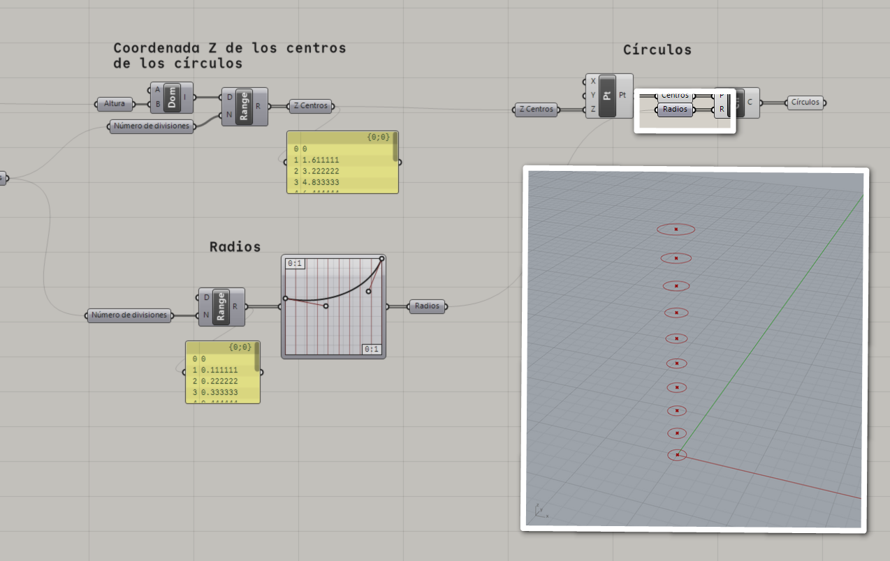

Por defecto, el _Graph mapper_ tiene un dominio de entrada de 0 a 1,
y un dominio de salida de 0 a 1.
Ya que los números que estamos mapeando están entre 0 y 1,
solo tenemos que modificar el dominio de salida.

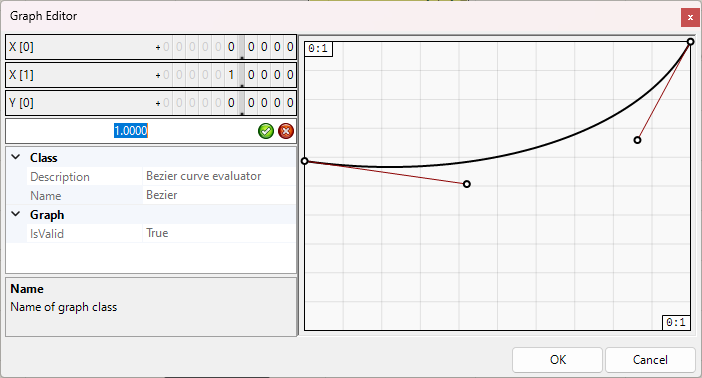

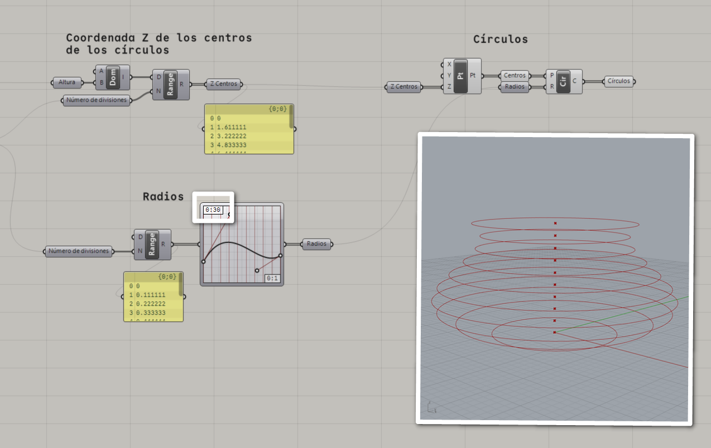

Ahora podemos crear una superficie de transición con los círculos.

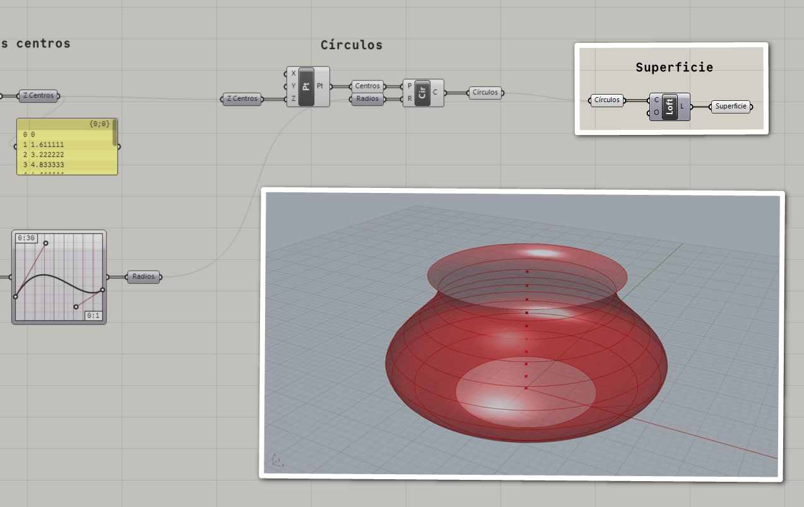
