# Atractores

El siguiente patrón está formado por círculos, pero cada uno tiene un radio
diferente.

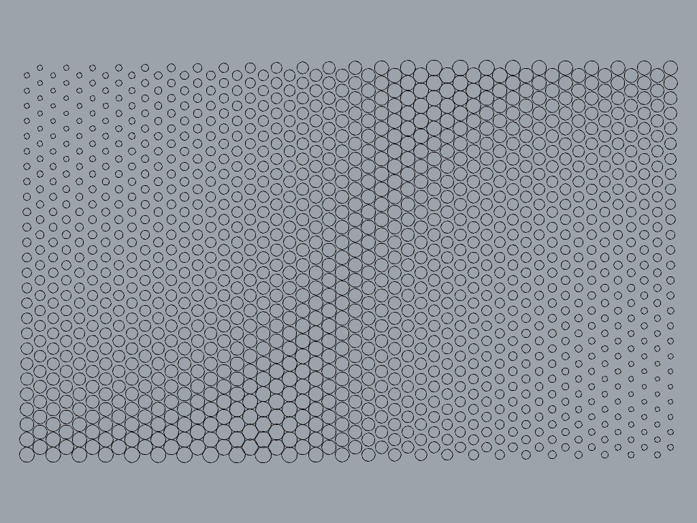

Para empezar, necesitamos definir el centro de cada uno de los círculos,
que están distribuidos en forma de una rejilla hexagonal.

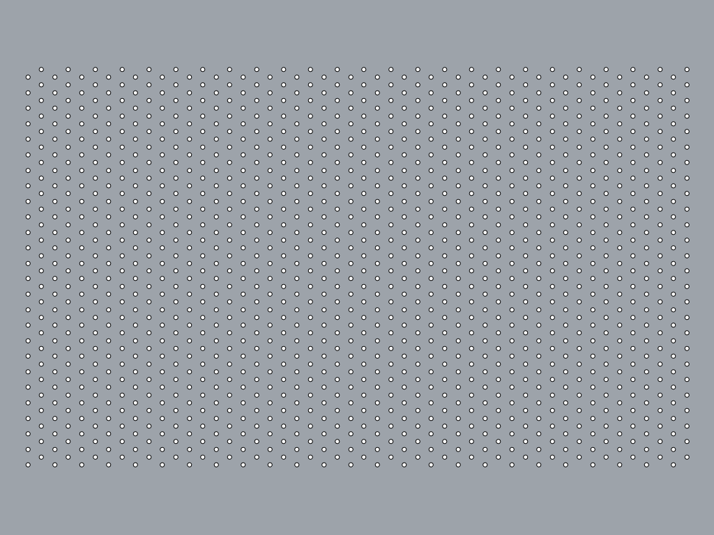

Podemos notar que los radios de los círculos crecen gradualmente según su distancia a un punto. En este caso, hay dos puntos que tienen influencia
en el radio de los círculos. Estos puntos se llaman **atractores**.

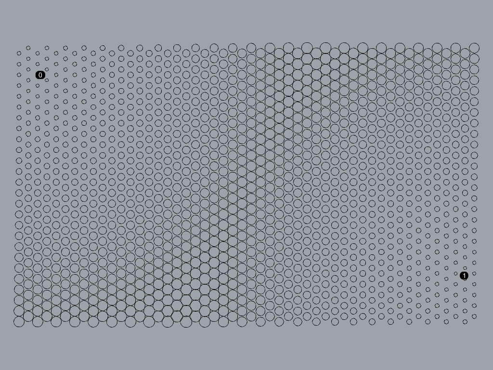

Los círculos más cercanos a un atractor tienen un radio pequeño;
los más lejanos tienen un radio más grande.
Esto significa que el radio de cada círculo depende de su distancia
al su atractor más cercano.

Para crear el patrón hexagonal de los centros de los círculos,
necesitamos un **número de filas** y un **número de columnas**,
además del **radio de cada celda hexagonal**.

Por otro lado, debemos definir qué radio tendrá el círculo
más cercano al atractor (**radio menor**),
y qué radio tendrá el círculo más lejano al atractor (**radio mayor**).

Ponemos en el lienzo los siguientes parámetros:

- número de filas (número entero)
- número de columnas (número entero)
- radio de celdas (número real)
- radio menor (número real)
- radio mayor (número real)
- atractores (puntos)

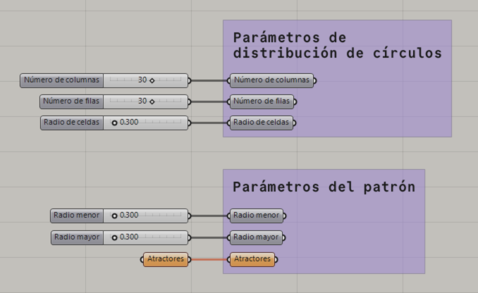

Primero, creamos la rejilla hexagonal para definir el centro de cada círculo
con el número de filas y de columnas que definimos en los parámetros.

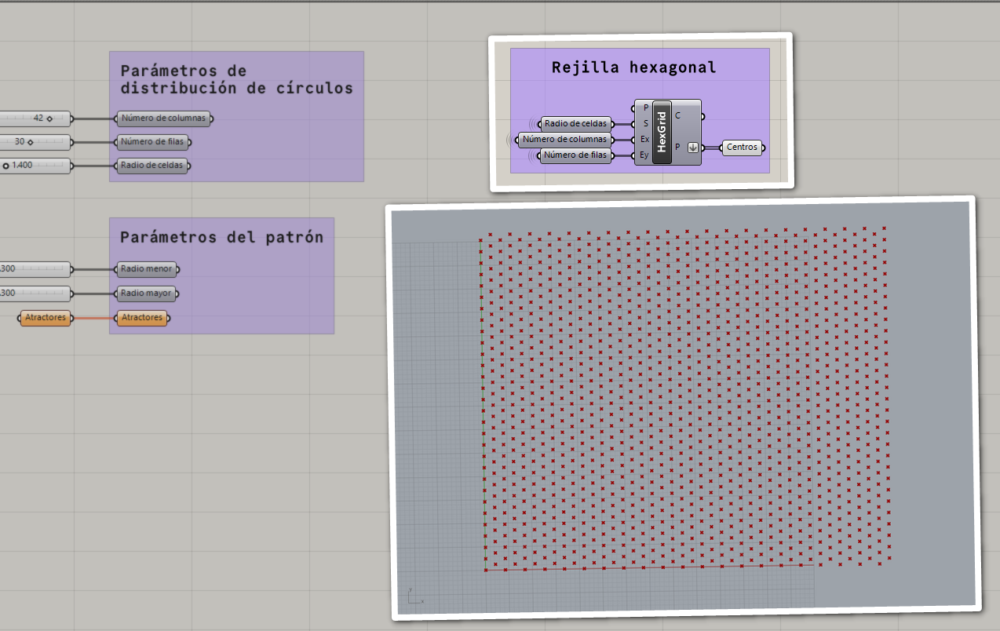

Según el análisis anterior, el radio de cada círculo está en función de la
distancia al atractor más cercano, así que primero debemos obtener
esa distancia. Para esto, primero definimos los puntos que serán
los atractores.

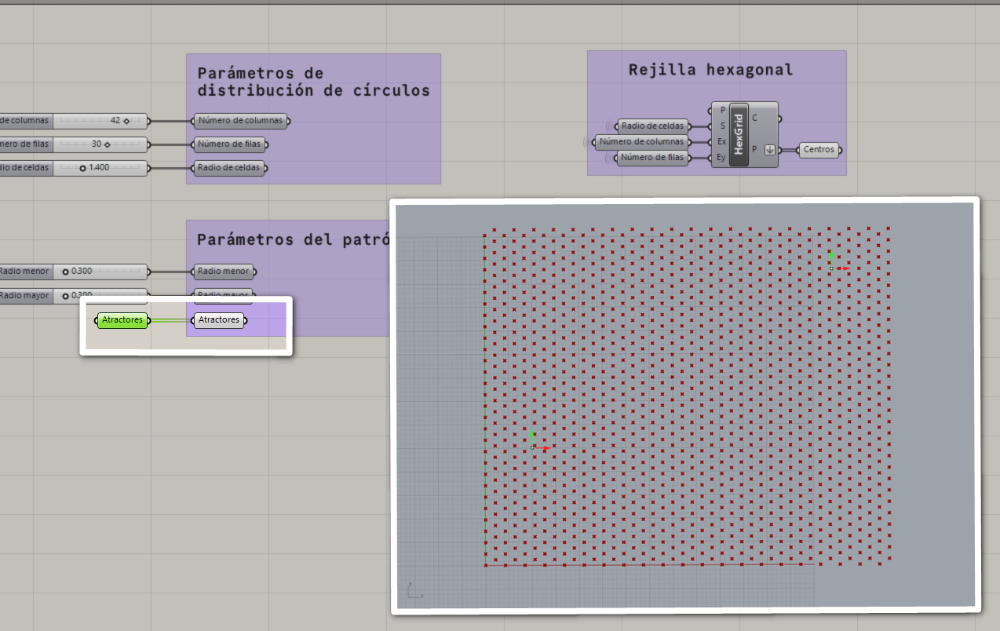

Ahora calculamos la distancia de cada centro al atractor más cercano.

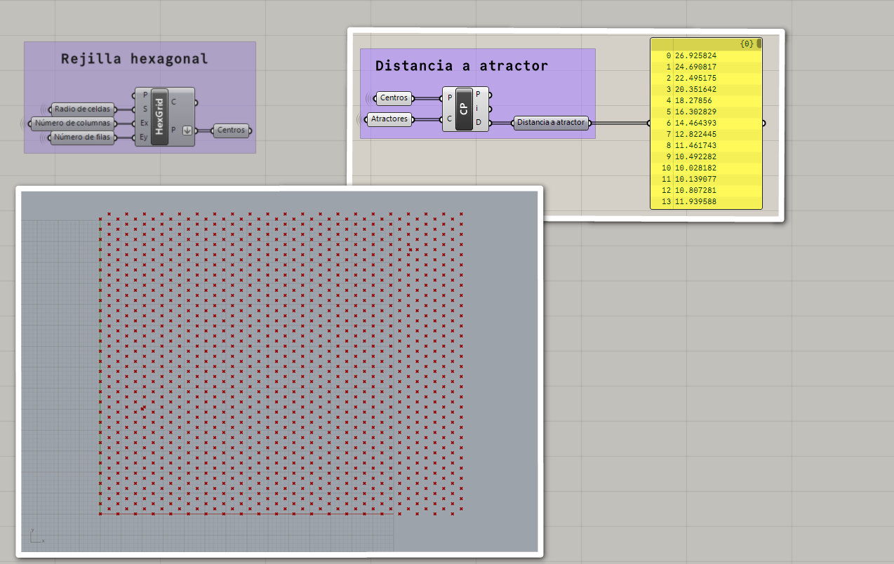

Anteriormente definimos la regla de que el círculo más cercano al atractor
tendrá el menor radio, y viceversa. Esto lo podemos lograr remapeando
cada radio.

Para remapear los radios, necesitamos un dominio de origen
y un dominio de destino. El dominio de origen es el dominio en el que se
encuentran las distancias que calculamos en el paso anterior.

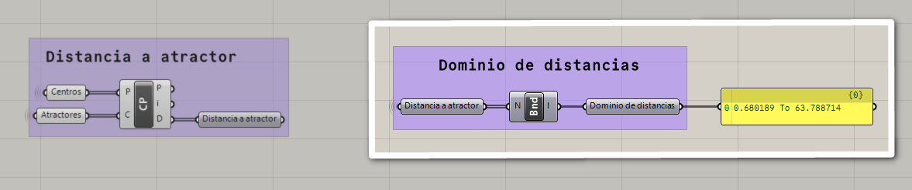

El dominio de destino, que será el dominio de radios,
indica cuál será el radio mayor y el radio menor,
datos que definimos en los parámetros.

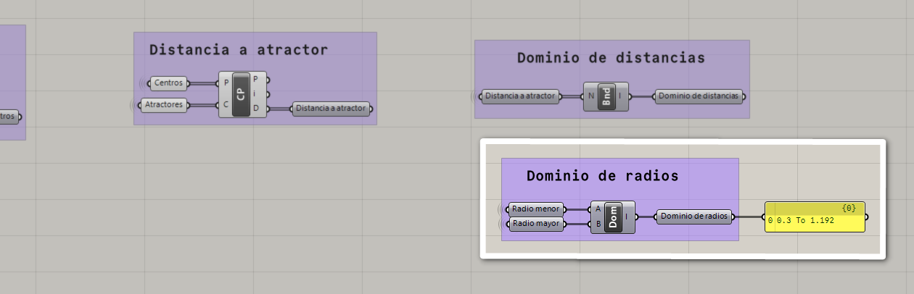

Ahora, para obtener el radio de cada círculo, vamos a remapear
la distancia del centro a su atractor del dominio de distancias
al dominio de radios.

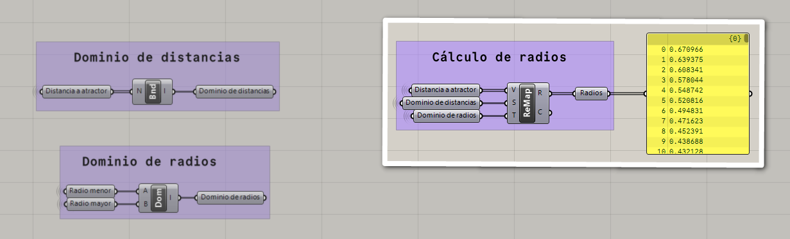

Ahora que tenemos los centros y los radios, podemos crear los círculos.

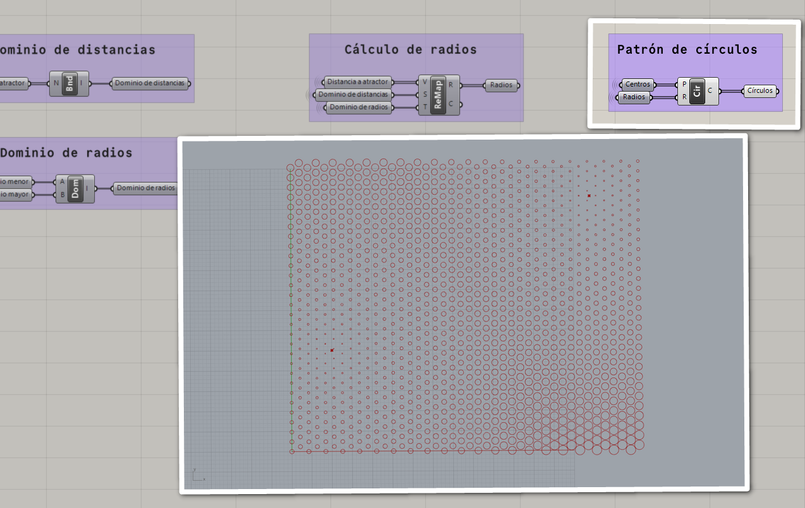
