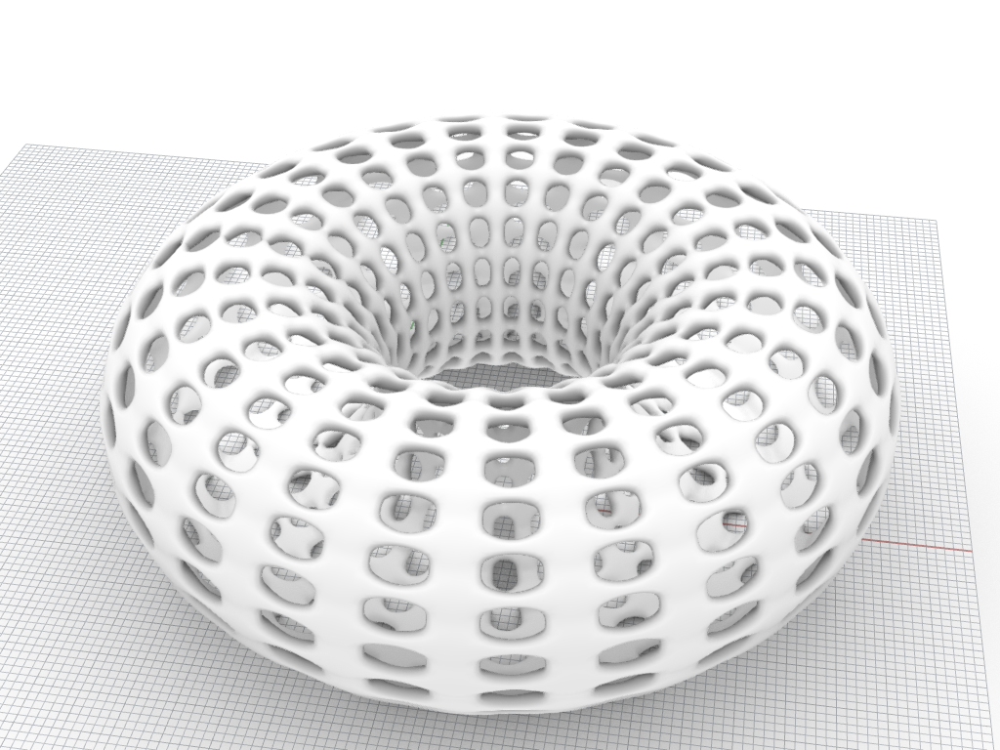
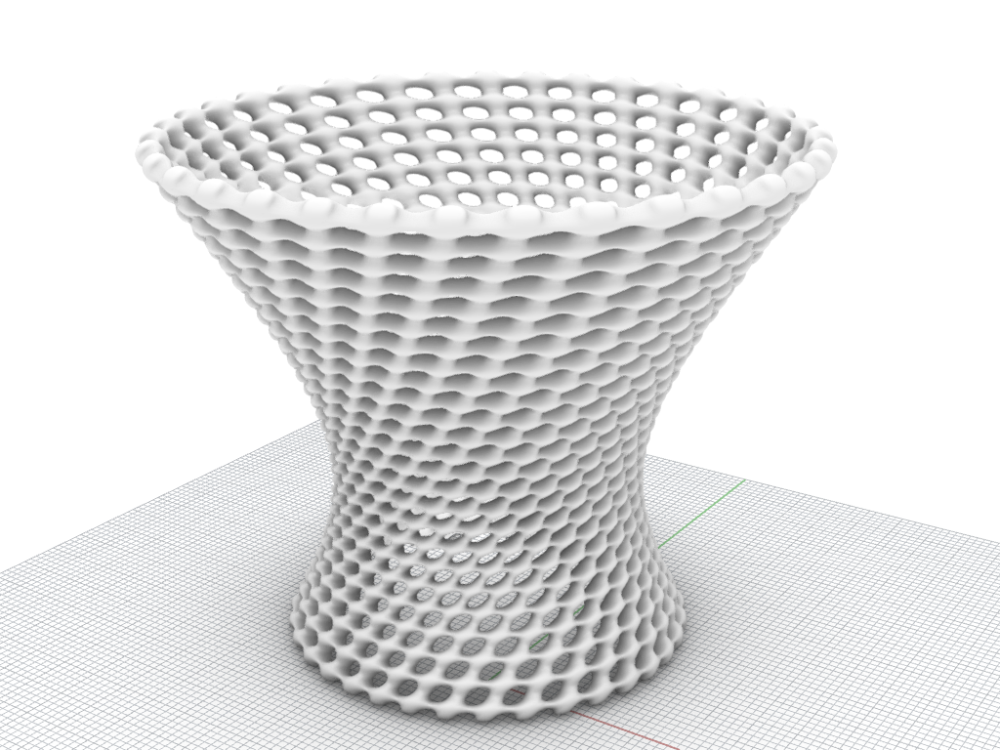
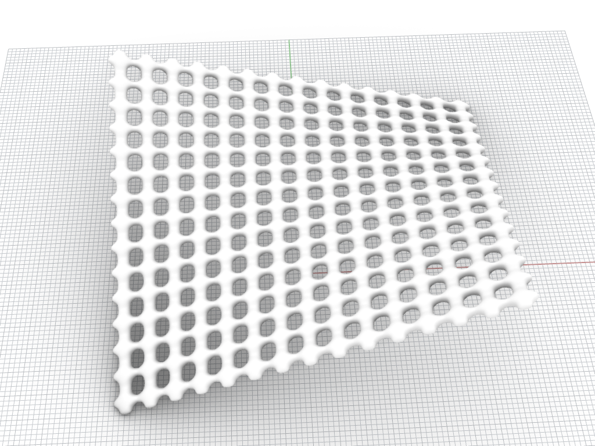
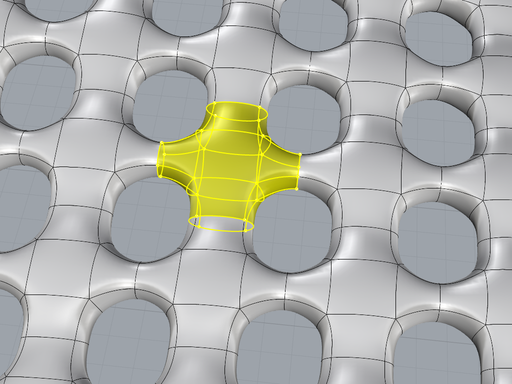
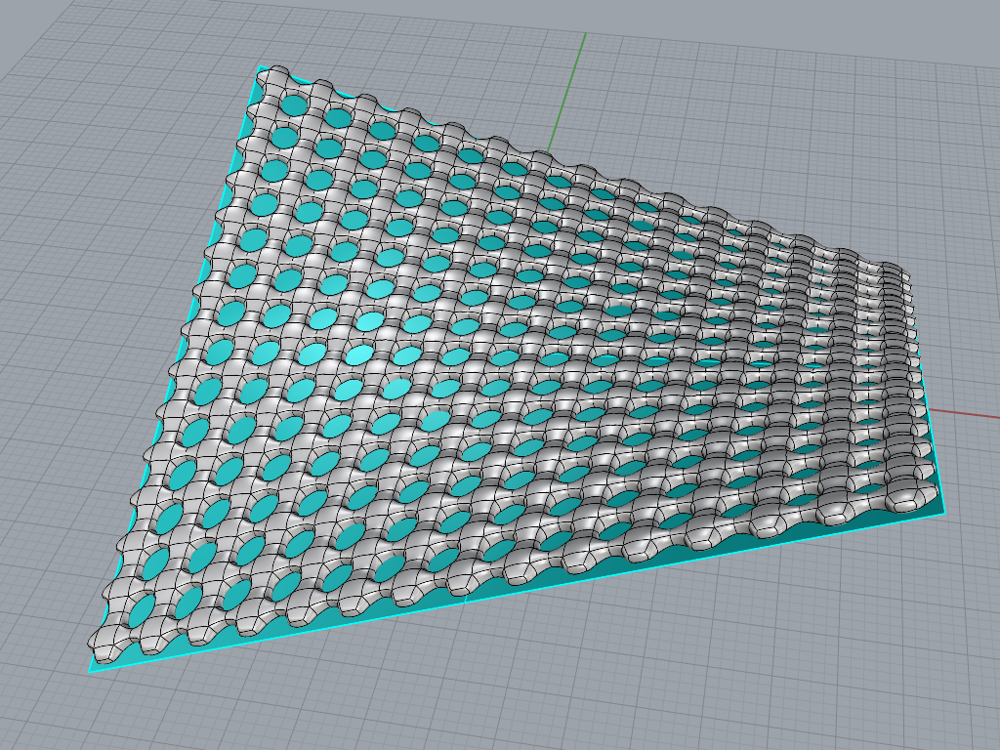
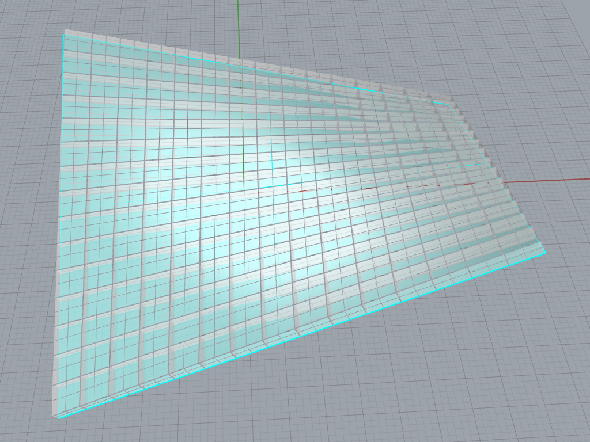
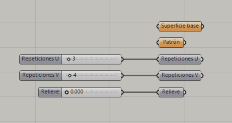
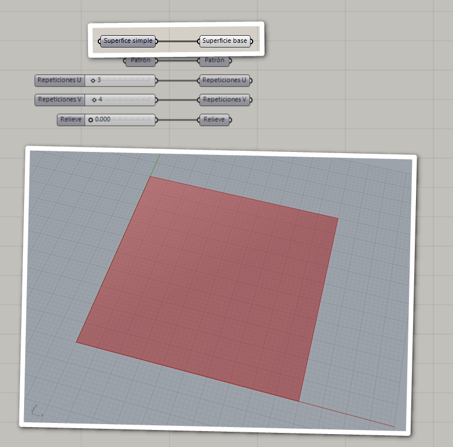
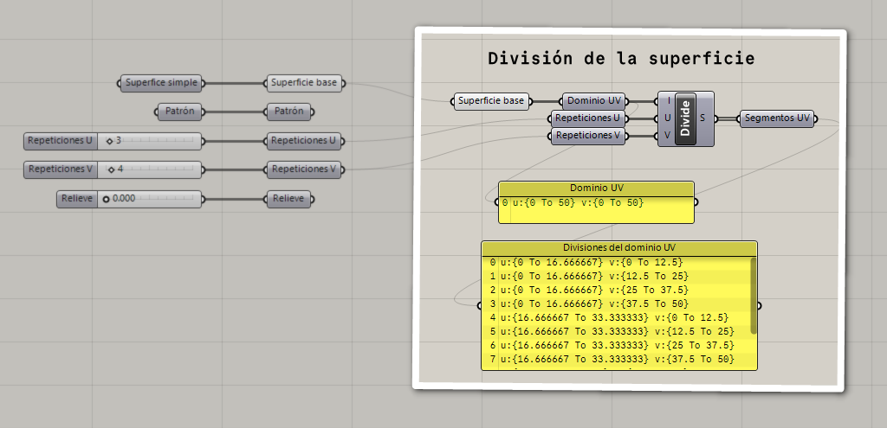
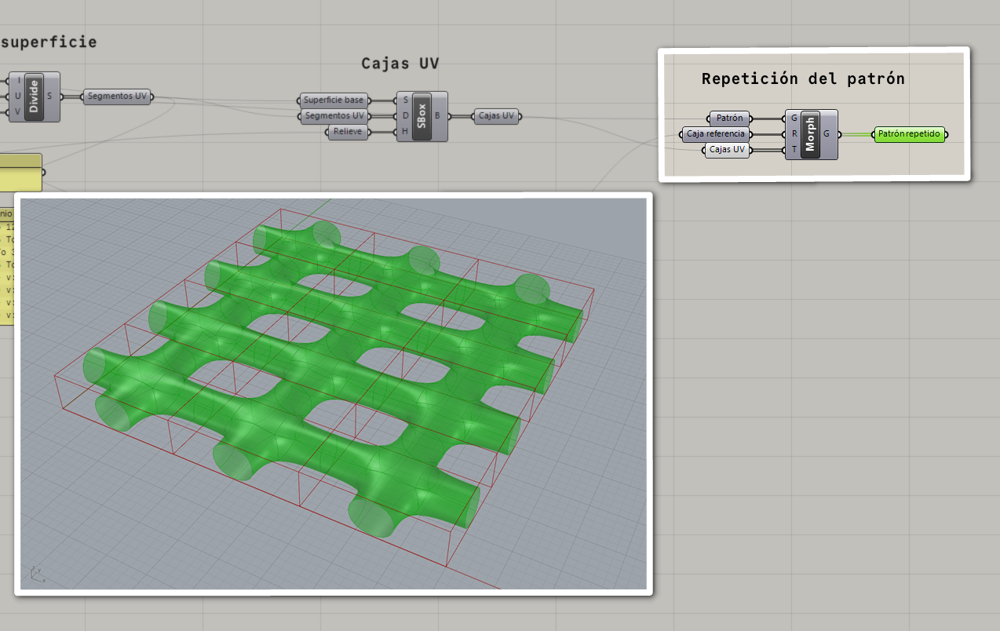

# _Box morph_

Vamos a analizar las siguientes figuras para encontrar los parámetros
que las caracterizan.

Podemos notar que hay un **patrón** que se repite en todas las figuras.

Este patrón se repite amoldándose a una **superficie**.

Se necesita especificar **cuántas veces se repite el patrón en U**
y **cuántas en V** sobre la superficie, además del **relieve** que tendrá.

Ponemos en el lienzo los parámetros que definimos:

- superficie base
- patrón (cualquier geometría)
- repeticiones en U (número entero)
- repeticiones en V (número entero)
- relieve (número real)

Creamos el patrón en Rhino y lo referenciamos desde Grasshopper.
En este caso, lo creamos con una superficie SubD.

Creamos la superficie base en Rhino y la referenciamos desde Grasshopper.

Para poder repetir el patrón sobre la superficie,
necesitamos crear las cajas en las que se colocará.
Estas cajas deben estar distribuidas sobre la superficie de acuerdo
al número de repeticiones en U y en V que definimos en los parámetros.

Para esto, tomamos el dominio UV de la superficie y lo dividimos en U y en V.
Cada segmento corresponde a una porción de la superficie base.

Ahora tomamos cada segmento UV para crear una caja sobre la superficie.
La altura de las cajas será el relieve que definimos como parámetro.

Para colocar el patrón en cada una de las cajas UV,
necesitamos una caja de referencia para especificar cómo se colocará el patrón
dentro de cada una de las cajas UV.

Una cada delimitadora nos puede servir como referencia.

Ya que tenemos el patrón, la caja de referencia y las cajas de destino,
podemos colocar el patrón en cada una.

[Volver »](..)
