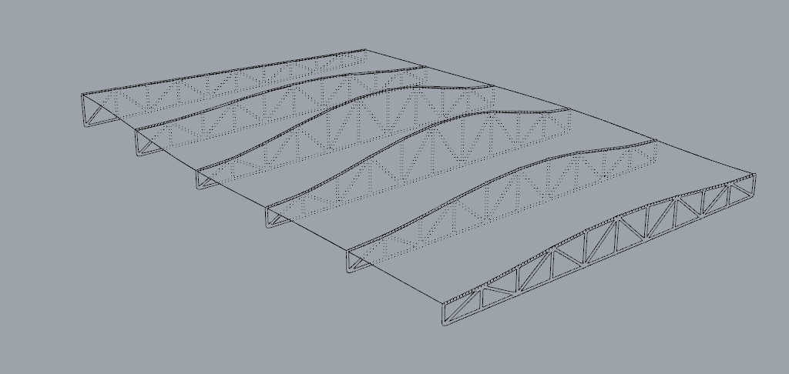
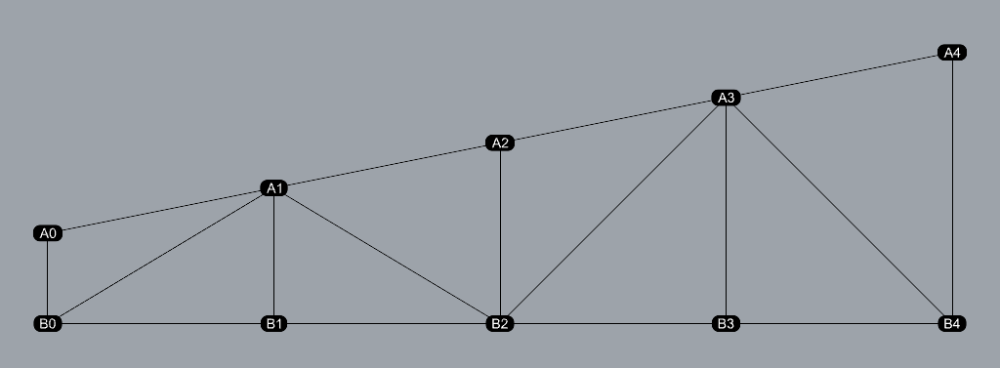
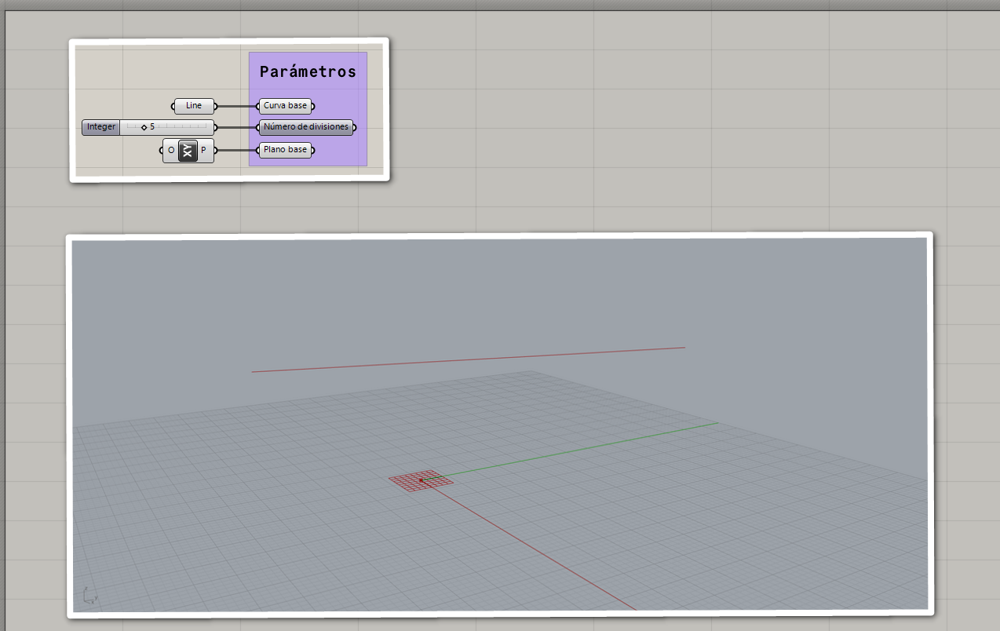
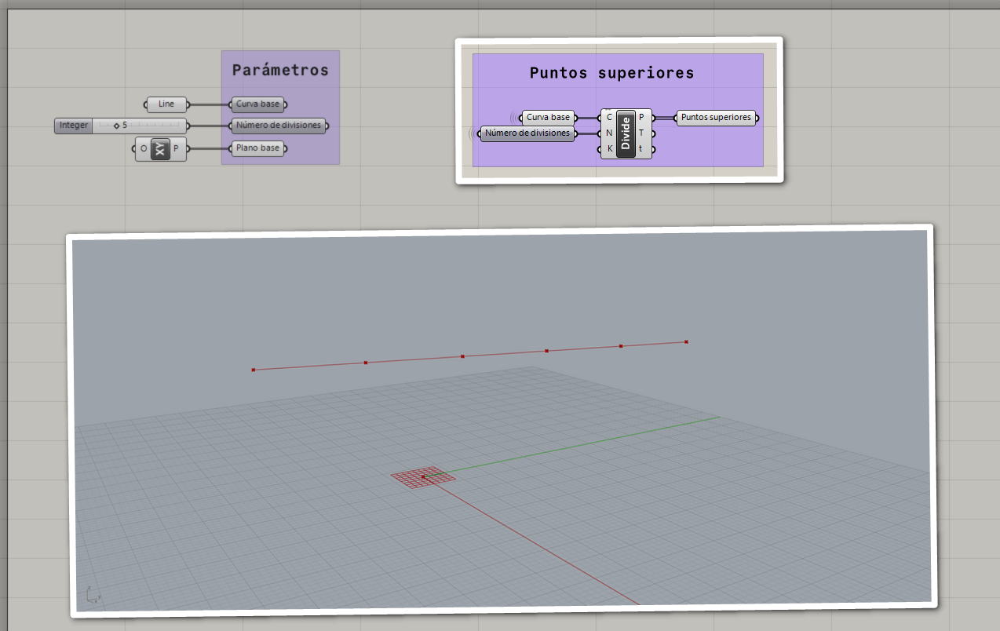
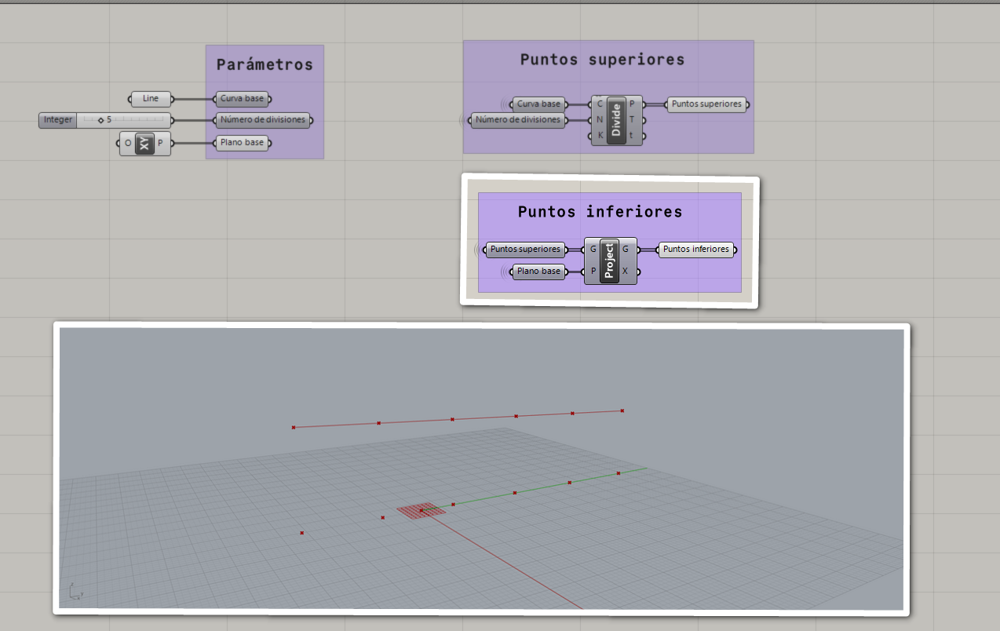
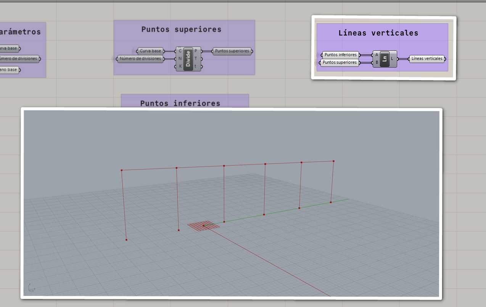

# Armadura 1

Si observamos la siguiente armadura, podemos notar que está formada por
varias estructuras cuya forma es parecida.

Para facilitar el análisis de cada una de las estructuras,
podemos utilizar una representación más abstracta de su forma.

En la primera imagen, vemos que cada estructura se amolda a la superficie,
o visto de otra manera, cada estructura se amolda a una curva
que se amolda a la superficie. Así podemos determinar que una estructura
necesita como parámetro una **curva base**.

Además, el **número de divisiones** a lo largo de la curva es otro parámetro
que necesitamos para la construcción de la estructura.

Por otro lado, en la primera imagen vemos que la base de todas las estructuras
está a la misma altura, por lo que necesitamos un **plano**
que defina esta altura.

Ponemos en el lienzo estos parámetros:

- curva base (curva)
- número de divisiones (número entero)
- plano base (plano)

Para obtener los puntos superiores, podemos dividir la curva base.

Los puntos inferiores los podemos obtener si proyectamos los puntos superiores
sobre el plano base.

Las líneas verticales las podemos crear fácilmente
con estas dos listas de puntos.

[Volver »](..)
